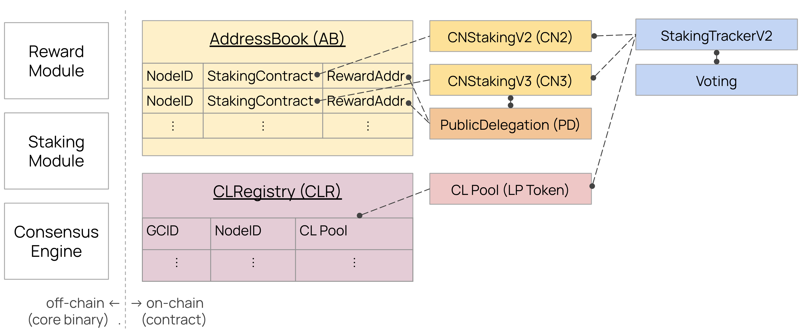
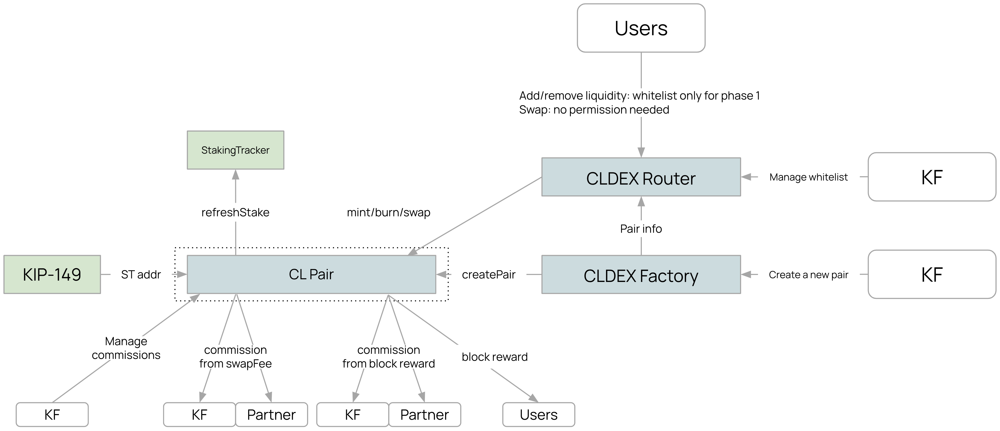

# Table of contents

- [Simple Summary](#simple-summary)
- [Abstract](#abstract)
- [Motivation](#motivation)
- [Specification](#specification)
  - [Terminology](#terminology)
  - [Overview](#overview)
  - [Configuration](#configuration)
  - [CLRegistry](#clregistry)
  - [StakingTrackerV2](#stakingtrackerv2)
  - [CLDEX](#cldex)
  - [Consensus](#consensus)
  - [On-chain Governance](#on-chain-governance)
- [JSON-RPC API](#json-rpc-api)
- [Rationale](#rationale)
- [Backward Compatibility](#backward-compatibility)
- [Copyright](#copyright)

## Simple Summary

Introduce a consensus liquidity mechanism for Kaia. The staked KAIA through the consensus liquidity will contribute to the consensus and [on-chain governance](https://kips.kaia.io/KIPs/kip-81) of Kaia.

## Abstract

This KIP introduces a consensus liquidity mechanism where KAIA and CL Token holders can participate in Kaia network through liquidity provision. Users stake KAIA tokens in the native decentralized exchange (CLDEX), simultaneously providing market liquidity and securing the network. Stakers earn both swap fees and block rewards, creating an efficient capital utilization.

The eligibility of GC remains unaffected by consensus liquidity, which means it still requires maintaining 5M KAIA staked solely through `CnStaking` contract, as is currently the case.

## Motivation

The current staking model often leads to capital inefficiency, where staked tokens remain idle. This KIP addresses this limitation by introducing consensus liquidity, which serves multiple purposes:

1. **New Utility**: Staked KAIA simultaneously secure the network and provide DEX liquidity, increasing the token utility.

2. **Enhanced Network Security**: By tying liquidity provision to consensus, we can expect more KAIA staked for the network, which enhances the network security.

3. **Sustainable Tokenomics**: The dual reward structure (swap fees + block rewards) creates a new utility and burn mechanism, building a sustainable tokenomics for Kaia and CL Token.

## Specification

The key words “MUST”, “MUST NOT”, “REQUIRED”, “SHALL”, “SHALL NOT”, “SHOULD”, “SHOULD NOT”, “RECOMMENDED”, “MAY”, and “OPTIONAL” in this document are to be interpreted as described in RFC 2119.

### Terminology

| Term                     | Description                                                                                              |
| ------------------------ | -------------------------------------------------------------------------------------------------------- |
| CnStaking                | The existing staking contract for Kaia. Usually referred as `CnStakingV2` or `CnStakingV3`               |
| Consensus Liquidity (CL) | A mechanism where KAIA and CL Token holders can participate in Kaia network through liquidity provision. |
| CLDEX                    | A decentralized exchange (DEX) on Kaia that allows users to trade KAIA and CL Token.                     |
| CL Token                 | A token pair with KAIA.                                                                                  |
| LP Token                 | A token representing the liquidity provider's share in the CLDEX.                                        |

### Overview

There'll be modified and new smart contracts to be developed.



- `CLRegistry`: A new registry for CLDEX. Manage the information of CLDEXs for `StakingTrackerV2` and Kaia core.
- `CLDEX`: A new smart contract for CLDEX. It consists of router, factory, and pool.
- `CLStaking`: A new smart contract to stake LP Token and distribute block rewards.
- `StakingTrackerV2`: A modified [staking tracker](https://kips.kaia.io/KIPs/kip-81) to track the staked KAIA in CLDEX for the governance. The existing `StakingTracker` contract will be deprecated.

The detailed information of each smart contract is described in the following sections.

### Configuration

The KIP-226 shall be activated since the `PRAGUE_FORK_BLOCK_NUMBER`.

| config                     | value |
| -------------------------- | ----- |
| `PRAGUE_FORK_BLOCK_NUMBER` | TBD   |

### CLRegistry

The CLRegistry contract must implement the ICLRegistry interface:

```solidity
interface ICLRegistry {
    struct CLInfo {
        /// @dev The node ID of the validator
        address nodeId;
        /// @dev The governance committee ID of the validator
        uint256 gcId;
        /// @dev The address of the CLDEX pool
        address clPool;
        /// @dev The address of the CLStaking
        address clStaking;
    }

    /// @dev Returns the CL information of all registered validators
    /// @return The CL information of all registered validators
    function getAllCLs() external view returns (address[] memory nodeIds, uint256[] memory gcIds, address[] memory clPools, address[] memory clStakings);
}
```

### StakingTrackerV2

The all external functions of `StakingTrackerV2` contract must have same selector and semantics as the existing `StakingTracker` contract to be compatible with the existing contracts.

The additional tracking processes of `StakingTrackerV2` are as follows:

1. Creating a new tracker: When creating a new tracker, the `StakingTrackerV2` contract must call `CLRegistry.getAllCLs()` to populate the CL information.
2. Updating the tracker: When the staked KAIA in `CLPool` changes, the `StakingTrackerV2` contract must update the staked KAIA for the corresponding validator.

#### Voting Power Eligibility

The validator is eligible for voting power if the staked KAIA in `CnStaking` is greater than or equal to 5M.

For example:

- Validator A: CnStaking (6M) + CLPool (5M) = 11M total stake, 2 voting power
- Validator B: CnStaking (4M) + CLPool (10M) = 14M total stake, 0 voting power

### CLDEX

The CLDEX is a decentralized exchange on Kaia for consensus liquidity based on UniswapV2's CPMM model and implementation. The liquidity providers (LPs) deposit KAIA and CL Token in the CLDEX and earn swap fees and block rewards. It consists of router, factory, pool and staking contracts.



#### Staking Requirements

1. All LP tokens in CLDEX MUST be subject to a minimum staking period of 7 days from the moment of provision, without exception. This differs from the traditional CnStaking withdrawal process as:

   - The 7-day period begins automatically upon LP token creation
   - No separate withdrawal request is required

2. There are separate steps needed for staking and unstaking.
   - Providing LP Token leads to staking automatically.
   - Unstaking LP Token leads to removing liquidity automatically.

It makes the calculation of the staked KAIA in CLDEX more easier since the all KAIA in CLDEX can be considered as staked.

#### Pair Creation and Management

1. CL Token pairs MUST be approved through governance before being listed on CLDEX
2. No duplicate pair is allowed on CLDEX. Only one pair per CL Token is allowed.
3. Only designated owner addresses SHALL have the authority to create new pairs
4. During the initial stability period:
   - Liquidity provision SHALL be restricted to designated addresses
   - After stability is confirmed, liquidity provision SHALL be opened to all participants
   - Swap SHALL be available to all participants since the beginning

#### Block Rewards

The CLDEX will receive block rewards from the Kaia core for contributing to the consensus. Note that the block rewards will be directly injected into the CLStaking contract, similar to the [Public Delegation](https://kips.kaia.io/KIPs/kip-163) contract.

1. Block rewards for CLDEX SHALL be distributed based on:
   - The proportional LP Token of each staker
   - Rewards SHALL be distributed per second to eligible stakers
   - No lockup period for rewards

#### StakingTrackerV2 Interaction

As `CnStaking` notifies its staked KAIA changes to `StakingTracker`, the CLDEX must notify to `StakingTrackerV2` whenever the staked KAIA in CLDEX changes. For example, based on UniswapV2's implementation, the target functions must call `stakingTrackerV2.refreshStake(address(this))`.

- `CLDEX.mint`: Used when providing liquidity
- `CLDEX.burn`: Used when removing liquidity
- `CLDEX.swap`: Used when swapping tokens
- `CLDEX.skim`: Used when skimming tokens

#### Commission

CLDEX commissions are derived from two sources:

1. Swap fees from CLPool
2. Block rewards from CLStaking

**Swap Fee Commission**:

- Commissions can be collected from swap fees
- Burn ratios can be configurable by token type (e.g., KAIA: 10%, CL Token: 5%)

**Block Reward Commission**:

- Commissions can be collected from block rewards

For both commission types, the following parameters are configurable:

- Commission receiver addresses
- Split ratios for each receiver address
- Burn ratios

### Consensus

After the `PRAGUE_FORK_BLOCK_NUMBER`, staked KAIA will be tracked through two mechanisms:

1. **CnStaking**

   - Existing staking mechanism through the `CnStaking` contract

2. **Consensus Liquidity**

   - New staking mechanism through CLDEX liquidity provision

Similar to voting power requirements, validators must maintain at least 5M KAIA staked in CnStaking to be eligible to propose blocks.
The total effective staked amount for staking rewards distribution is calculated as:

```
totalEffectiveStakedKAIA = staked KAIA in CnStaking + staked KAIA in CLDEX
```

#### Block Rewards Distribution

The total block reward for each validator will be calculated based on [KIP-82](https://kips.kaia.io/KIPs/kip-82), while the split ratio between `CnStaking` and `CLDEX` will be proportional to their respective staked KAIA amounts.

### On-chain Governance

The on-chain governance will be maintained except using `StakingTrackerV2` instead of `StakingTracker`.

#### StakingTracker Replacement Process

1. Deploy the new `StakingTrackerV2` contract
2. Propose a `StakingTracker` replacement on Voting
3. After the proposal is approved, the new `StakingTrackerV2` contract will be set for Voting
4. Replace all `StakingTracker` contracts of `CnStaking` with `StakingTrackerV2`

## JSON-RPC API

### `kaia_getStakingInfo`

The new field `clStakingInfo` will be added to the response of `kaia_getStakingInfo` to provide the CLStaking information.

- Example

  ```json
  // Request
  curl -X POST -H "Content-Type: application/json" --data '{"jsonrpc":"2.0", "method":"kaia_getStakingInfo", "params":["latest"],"id":1}' http://localhost:8551
  // Response
  {
  "jsonrpc":"2.0",
  "id":1,
  "result": {
      KIRAddr: "0x6c38302e00dbac91712d93ab94b4a827698be6f1",
      PoCAddr: "0xc8757a6b5b427ddcd5781c9faa5e41318d32336a",
      blockNum: 109,
      clStakingInfos: [{
            clNodeId: "0x4e37f45ab0385782afbbc713f4b0d5f936ba2201",
            clPoolAddr: "0x07987c97befca39f6fcf884271cc65f85d8d1a5b",
            clRewardAddr: "0x10fd8bf375208e62077016d58329d2986eed45ce",
            clStakingAmount: 5000000
      }, {
            clNodeId: "0x681f56e59003172201d155ca8a5dbe0ad0993641",
            clPoolAddr: "0xe1f42e74dbf400affd54553a7c258b88ab3e2a8f",
            clRewardAddr: "0x7b056bafbddb86de6090afb572880d34451a46d0",
            clStakingAmount: 10000000
      }],
      councilNodeAddrs: ["0x4e37f45ab0385782afbbc713f4b0d5f936ba2201", "0x681f56e59003172201d155ca8a5dbe0ad0993641", "0x7fcd59726eb6560f385c195ff33db9385aadf644", "0x15245589f68c14690cbcc3131256aeb594a006f7"],
      councilRewardAddrs: ["0x1ffdee22fa4df55d66dea1d9435343be2c0d3b12", "0xf411483d602620203bbfc9ba87e38bcfb6430b90", "0x2836a57c4fc95537ba2c3b1587d2a7d195a278e6", "0x6b4679e1a0aa81ffcab3e0b70044b3c0928b7f44"],
      councilStakingAddrs: ["0xcf24c0f2e12c534046f32d1bd072e9eabbe1012d", "0xd08ace335231e523c5cf7c0b1078a7365f3a606d", "0x2c701c0bf6792a4643dc095547494357b92b5d72", "0x4539ccc933283507d11aff505ea3fb47fad1d282"],
      councilStakingAmounts: [5000000, 10000000, 15000000, 20000000],
      gini: 0.13,
      kcfAddr: "0x6c38302e00dbac91712d93ab94b4a827698be6f1",
      kefAddr: "0x6c38302e00dbac91712d93ab94b4a827698be6f1",
      kffAddr: "0xc8757a6b5b427ddcd5781c9faa5e41318d32336a",
      kifAddr: "0xc8757a6b5b427ddcd5781c9faa5e41318d32336a",
      useGini: false
      }
  }
  ```

## Rationale

### Separate Reward Address

The validator only has one reward address even if it has multiple `CnStaking` contracts. But this KIP will break that invariant by separating the reward address for `CnStaking` and `CLDEX`. It's natural to separate the reward address since consensus liquidity is a new staking mechanism and has different form and reward profile.

### Minimum Staking Period

The decision not to implement a 7-day waiting period after unstaking request (like in CnStaking) was made for several reasons. From a consensus perspective, since Kaia's validators will be selected as proposer randomly based on [KIP-146](https://kips.kaia.io/KIPs/kip-146), requiring 5M in CnStaking provides sufficient protection against consensus instability. From a governance perspective, while it's important to prevent sudden voting power shifts in response to specific proposals, this can be adequately addressed through the minimum staking period alone. Additionally, LP assets receive comparatively lower block rewards relative to their invested assets compared to CnStaking, and are subject to impermanent loss risks. Therefore, to promote CL adoption through the ecosystem, the requirements were made more lenient to allow users to utilize CL more easily.

### 5M KAIA in CnStaking to be validator

As mentioned in the [Minimum Staking Period](#minimum-staking-period), the 5M KAIA in CnStaking is to prevent the consensus instability. It'll act as a safety margin for network stability. Even if the validator is not malicious, the staked KAIA in CLDEX can be extremely volatile due to the external market conditions. It's not reasonable to rely solely on the volatile staked KAIA.

## Backward Compatibility

### StakingTrackerV2

The `StakingTrackerV2` contract will support same functions as the existing `StakingTracker` contract to be compatible with the existing contracts.

## References

- [Enrinshed Liquidity](https://docs.initia.xyz/about/enshrined-liquidity-and-staking)
- [Proof of Liquidity](https://docs.berachain.com/learn/what-is-proof-of-liquidity)

## Copyright

Copyright and related rights waived via [CC0](https://creativecommons.org/publicdomain/zero/1.0/).
