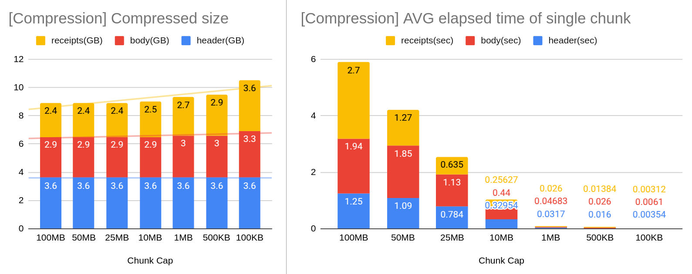
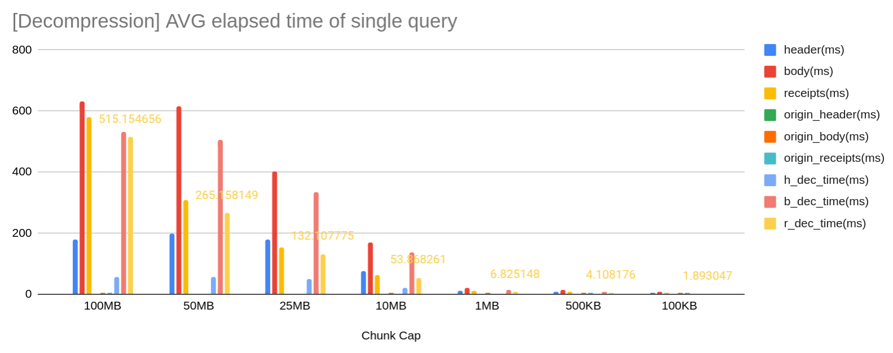

## Abstract
Compress the block header, body, and receipts data in its persistent form to reduce disk usage.
With an efficient data structure, historic data remains accessible with minimal query overhead from the lossless-compressed database.

## Motivation
Kaia has been focusing on optimizing the state trie storage through [state migration and live pruning](https://docs.kaia.io/learn/storage/state-pruning/).
While these optimizations dealt with the most significant part of the database, there is still potential to further reduce the other parts of the database.
This KIP reduces the storage footprint of the following three data types:
- Header: RLP-encoded block header. Most header fields are repeated across headers.
- Body: RLP-encoded transaction bodies in a block. Transaction calldatas tend to contain many zero bytes and the contents are often similar between different transactions.
- Receipts: RLP-encoded transaction receipts in a block. Receipt event logs tend to contain many zero bytes and the contents are often similar between different transactions.

The three data types are generated every time a new block is inserted.
They consume a substantial amount of storage. As of 2024-12-02, In the migrated mainnet chaindata, the header, body, and receipts account for 10.4%, 28.1%, and 40.9% of the total size, respectively, which together occupy 79.4% of the node's disk space.
This illustrates that the state trie is no longer a dominant data in the full-node with pruned states.
This KIP proposes to compress the three data types to reduce the total disk size, thereby making the node operation more efficient and affordable.

## Specification

### Compression
A node periodically compresses storage in a background thread and removes the original data once it is confirmed safe to do so.
Data is compressed in units called "chunks". Selecting a good chunk size is described in [Appropriate Chunk Size](#rationale).

### Decompression
Decompression is required when a node receives a query (header, body, or receipts).
The node first searches for the corresponding data in the original database.
If the data is not found, it locates the decompressed chunk and performs the decompression. Finding a corresponding chunk is O(1) as we store chunk with a key `to-from`.
Below shows an example how to store and retreive a chunk.
```
[from-to] --> [to-from]
1001-2000 --> 2000-1001
2001-3000 --> 3000-2001
3001-4000 --> 4000-3001
```
If a header 2551 is queried, the key-value iterator immediately hits the `3000-2001` key becuase of the ascending order iteration.
Once found and decompresse it, the decompressed chunk is cached for later use.

### Retention
The compression feature can retain uncompressed data for at least N retention blocks, enabling fast retrieval without decompression overhead.

### Evaluation
Evaluation on a [state-migrated mainnet (as of 2024-12-02)](https://packages.kaia.io/mainnet/chaindata/) showed a significant reduction in its disk size. Body and receipts showed high compression rates thanks to their high data repetition.

| Data | Uncompressed (GB) | Compressed (GB) | Reduction (%) |
| ------- | ------- | ------- | ------- |
| Header | 410 | 261 | 36.3% |
| Body | 1100 | 267 | 75.7% |
| Receipts | 1600 | 179 | 88.8% |
| Others | 1100 | 1100 | 0% |
| Total | 4200 | 1737 | 57.21% |

It took 3 days for background compression threads to complete.

## Rationale

### Appropriate Chunk Size
An optimal chunk size should balance a high compression rate with minimal decompression overhead.
Determining the ideal chunk capacity remains an open problem. However, our experiments suggest that a 1MB chunk size offers a favorable trade-off.




Currently, the chunk size is fixed at 1MB and cannot be configurable.

### Compression Algorithm
The default algorithm selected for compression and decompression is [Zstd](https://github.com/klauspost/compress).
Zstd demonstrates [strong performance compared to other schemes](https://docs.google.com/spreadsheets/d/1nuNE2nPfuINCZJRMt6wFWhKpToF95I47XjSsc-1rbPQ/edit?gid=1088551794#gid=1088551794).
We tested all [available encoder options](https://github.com/klauspost/compress/blob/v1.17.11/zstd/encoder_options.go#L146) but found no significant differences. The default mode remains fixed.

## Backwards Compatibility
An existing database can be compressed without node shutdown.
APIs querying the historic blocks, transactions, and receipts must work correctly because the data are not lost.

## Implementation
https://github.com/kaiachain/kaia/pull/155

## Copyright
Copyright and related rights waived via [CC0](https://creativecommons.org/publicdomain/zero/1.0/).

