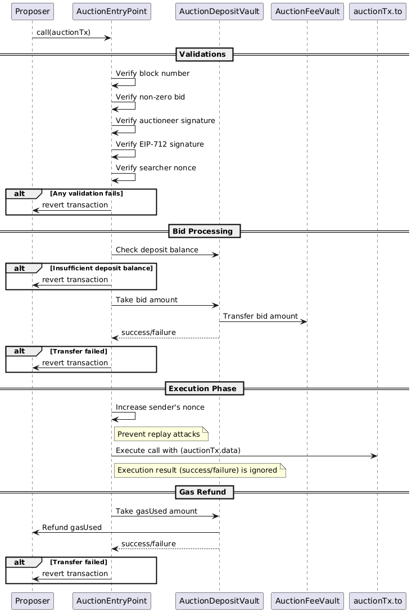

## Simple Summary

This KIP defines a **slot-based** mechanism in Kaia, where the **auction-winning call** is placed immediately after its **target transaction** to capture backrunning MEV. Searchers deposit funds in a vault, ensuring coverage for **bid \+ gas**, and an **AuctionEntryPoint contract** handles bid payment, execution of backrun logic, and gas refunds atomically. Collected fees are routed to a governance-controlled vault, providing transparency and flexibility in distributing MEV proceeds.  
 

## Abstract

MEV (Maximal Extractable Value) commonly arises when a **backrun** exploits state changes immediately after a target transaction. This KIP enforces a **slot-based** adjacency, ensuring the winning call is placed directly after its target in a block, minimizing reorder opportunities. Searchers maintain a deposit in a vault, guaranteeing coverage for both **bid** and **gas**. They submit off-chain bids to an Auctioneer, and the final transaction is crafted and signed by the block **proposer**, enforcing adjacency. An **AuctionEntryPoint** contract handles the atomic collection of bids, execution of backrun logic, and gas reimbursement in a single transaction. Any fees collected are routed to a **governance-controlled** `AuctionFeeVault`, enabling Kaia to capture and distribute MEV proceeds transparently.

## Motivation

Currently, the MEV on Kaia network has the following issues: 

1. The profit generated from MEV is centralized.  
2. The spamming transactions inefficiently congest the network.

Also, during transition to the permissionless network, we’d expect these issues will have even more impact. To address these, we need a structured MEV approach so we can enhance user experience and decentralization while maintaining a sustainable and stable network.

## Specification

## Key Mechanisms

1. **Hidden Bidding**  
     
   - Searchers privately submit bids to the off-chain Auctioneer.  
   - The Auctioneer chooses the highest valid bid and sends the auction result to the validators.

   

2. **Slot-Based Adjacency**  
     
- Ensures if a target transaction is placed at index *i*, the backrun (`AuctionEntryPoint.call`) call is at *i+1*.  
- Reduces reorder exploits by preventing free-form placement of backrun transactions elsewhere in the block.  
- If no target transaction is found, the backrun transaction will be dropped.


3. **Bundle**  
     
   - The winner’s bid will be signed by proposer and bundled based on the KIP-245.  
   - Bypasses the block generation limit during the execution of BidTx.  
   - Discard the bundle if it encounters revert during the execution of BidTx to prevent balance loss of proposer.  
       
4. **Deposit & Cooldown**  
     
   - A dedicated `AuctionDepositVault` requires each searcher to lock up enough funds for their bid and gas.  
   - A cooldown on withdrawals prevents immediate removal of deposits, enforcing fund coverage for the bids.

   

5. **Governance-Controlled Fees**  
     
   - Proceeds from winning bids go into an `AuctionFeeVault`.  
   - Kaia’s on-chain governance decides the split (e.g., treasury vs. proposer) and any further uses of these funds.

### Terminology

| Term | Description |
| :---- | :---- |
| **Slot** | The position immediately following a target transaction in a block’s transaction list. |
| **Target Tx** | A user transaction that triggers a backrun opportunity. |
| **Auctioneer** | Off-chain entity coordinating hidden bids among searchers and picking the winning call. |
| **Searcher** | A participant who provides a deposit and hidden bid, including the target reference, to the Auctioneer. |
| **AuctionEntryPoint** | A contract that handles bid payment, execution of backrun logic, and gas refunds atomically.  |
| **AuctionDepositVault** | A contract storing each searcher’s deposit, allowing a two-step withdrawal. |
| **AuctionFeeVault** | A governance-owned contract capturing the bid amounts. |

---

### Auction Rules

#### Hidden Bidding

- Searchers sign their intended `bid` **offline**.  
- The Auctioneer selects the **highest valid bid**, then sends the winning bid to the proposer for forming **one transaction** calling `AuctionEntryPoint` in the **final block**.

#### Searcher Bid Limit

- Each searcher may place **one winning valid bid per block**.  
- Any additional bids submitted by the same searcher address for the same block will be disregarded by the Auctioneer and proposer.

#### Slot Concept

- If the **targetTx** is at index *i*, the `AuctionEntryPoint` call is placed at *i+1*.

#### Target and Backrun Adjacency

- The backrun call is at index *i+1* if the targetTx is at *i*.  
- If the proposer **does not have** the targetTx on the same block of the backrun tx, it removes the backrun Tx automatically.  
- If the target transaction has been executed without revert, the bid will be paid regardless of execution result of backrun logic.


#### Early Deadline

- The **block proposer** will enforce an **early deadline** for normal user transactions to ensure the duration of an auction.  
- After that, only the **winning** backrun call and its target can still be appended.

```py
# Filters out the late non-target transactions exceed earlyDeadline.
def filter_tx(txs, bidTargetTxs, earlyDeadline):
    txs[:] = [tx for tx in txs if not (tx.time > earlyDeadline and tx not in bidTargetTxs)]
```

---

### Auction Result Validation

The auction result will be \`BidDetails\` where the bid is RLP-serialization of the following:

```
rlp([target_tx_hash, block_num, sender, nonce, to_addr, call_gas_limit, call_data, bid_amount, from_signature, auctioneer_signature])

auction_type_hash = keccak256("AuctionTx(bytes32 targetTxHash,uint256 blockNumber,address sender,address to,uint256 nonce,uint256 bid,uint256 callGasLimit,bytes data)")
```

Please note that it’s not the transaction, but the bid.

```
@dataclass
class BidDetails:	
	target_tx_hash: Hash32 # Equivalanet to common.Hash in Go
	block_num: int # The target block number
	sender: str # The searcher address who has enough deposit balances
	nonce: int # The nonce of searcher in the AuctionEntryPoint, not blockchain account's nonce
	to_addr: str # The target address of backrun logic
	call_gas_limit: bytes # The gas limit of backrun logic
	call_data: bytes # The call data of backrun logic
	bid_amount: bytes # The bid amount in Kei
	from_signature: bytes # ECDSA.sign the hash typed data V4 with auction_type_hash based on EIP-712 by searcher's private key.
	auc_signature: bytes # ECDSA.sign the from_signature based on EIP-191 by auctioneer's private key
```

The proposer verifies the \`BidDetails\` in the following order.

1. Verify the both signatures from searcher and auctioneer.  
   1. The auctioneer address will come from the AuctionEntryPoint contract.  
2. Verify the \`Bid.blockNum \== currBlockNum \+ 1 && \!MiningNotStarted\`  
   1. MiningNotStarted is a flag representing the current mining status.  
3. Verify the \`Bid.bid\_amount \>= min\_bid\_amount\`.

---

### Block Building

The verified bids will wait for the next block mining. When the mining starts, the proposer will place the bid results into block with following steps:

1. Retrieve target tx hash from bids  
2. Drop all txs that arrive after the early deadline except the target tx.  
3. Drop all bids that have no corresponding target tx in the current tx list.  
4. Verifying that the searcher has enough deposit balance to pay the \`bidAmount\` and \`gasFee\`. If not, drop all the bids from a searcher.  
5. Verifying that the searcher has the correct nonce in AuctionEntryPoint.  
6. Make an unsigned BidTx and bundle for each bid and place them after the target tx.

#### BidTx

The proposer shall inject a transaction denoted by BidTx, which calls the AuctionEntryPoint contract. The BidTx will follow the below rules:

1. BidTx.type is 0x7802, which is the Ethereum Dynamic Fee transaction type.  
2. BidTx.to is an AuctionEntryPoint contract.  
3. BidTx.value is 0  
4. BidTx.data shall be correctly encoded for \`AuctionEntyPoint.call\`.  
5. BidTx.maxFeePerGas, BidTx.maxPriorityFeePerGas shall be the same as those of target tx.  
6. BidTx.gasLimit shall be set large enough to cover the gas fee including \`Bid.call\_gas\_limit\`.

After building the BidTx, the proposer will make a BidTx bundle based on the KIP-245.

#### BidTx Bundling

After making the BidTx, it will be bundled based on the KIP-245. Please note that the bid bundle doesn’t include target tx but single bid tx so that the target tx can’t be delayed/canceled due to bundling.

```
Original tx list: [Tx1, Tx2, Tx3, Tx4]
Target tx: Tx2
BidTx bundle: {targetTx: Tx2, bundleTxs: [B2]} // not [Tx2, B2]

Final tx list: [Tx1, Tx2, [B2], Tx3, Tx4]
```

Please note that the proposer doesn’t sign the BidTx yet and it’ll be done right before executing the BidTx. This is because we can’t finalize the nonce of the proposer before executing all previous transactions and bundles when there're more than one bundle in the same block.  

---

### Smart Contract

#### AuctionEntryPoint

The AuctionEntrypoint is a singleton smart contract that implements a function that includes all logic for paying the bid, executing the backrun, and refunding gas. It also manages the address of a valid auctioneer which will be used to verify the auctioneer’s signature. The address of AuctionEntrypoint will be registered in the system registry defined in [KIP-149](https://kips.kaia.io/KIPs/kip-149).

|  |
| :----------------------------------------------: |
|         The execution sequence of BidTx          | 

The AuctionEntryPoint will verify auctionTx and will return/revert the transaction. Since the BidTx is bundled, the propose won’t pay the gas fee if it’s reverted, otherwise it will pay the gas fee.

```
interface IAuctionEntryPoint {
    /* ========== STRUCT ========== */

    struct AuctionTx {
	 bytes32 targetTxHash
	 uint256 blockNumber
        address sender;
	 address to;
        uint256 nonce;
        uint256 bid;
        uint256 callGasLimit;
        bytes data;
 bytes auctioneerSig;
        bytes searcherSig;
    }

    // @dev Returns the address of current auctioneer.
    function auctioneer() external view returns (address);
   
    // @dev Returns the current nonce of address.
    function nonces(address) external view returns (uint256);
	
    // @dev Executes the all bid operations.
    function call(
        AuctionTx calldata auctionTx,
    ) external
}
```

#### AuctionDepositVault

The AuctionDepositVault is a singleton smart contract that implements a function that returns the current deposit balance of a searcher. It’s used when the proposer verifies if a searcher has enough deposit balance to pay all the bids and gasFee.

```
interface IAuctionDepositVault {
    // @dev Returns the current deposit balance of address.
    function depositBalances(address) external view returns (uint256);


    // @dev Deposits KAIA into vault.
    function deposit() external payable;

    // @dev Starts cooldown period to withdraw KAIA.
    function reserveWithdraw() external;

    // @dev Withdraws KAIA after cooldown period.
    function withdraw() external;
}
```

#### AuctionFeeVault

The AuctionFeeVault is a governance-owned smart contract that captures and distributes the bid amounts. After executing each bid, the bidAmount will be sent to AuctionFeeVault.

```
interface IAuctionFeeVault {
    // @dev Receives KAIA
    receive() payable external;
	
    // @dev Distributes the KAIA to multiple receivers.
    // @dev Please note that this function must be called by governance-owned sender (e.g., KIP-81 Voting contract)
    function distributeFee(address[] memory, uint256[] amounts) external;
}
```

---

### Auctioneer Node

The auctioneer is the independent node that relays the auction process. It validates the searcher’s bid, selects the winning bidder, and sends it to the validators.  
Once the searchers deposit the KAIA into AuctionDepositVault, the auctioneer node will catch the event and recognize the searcher address.  
The auctioneer node will implement the following json-rpc APIs for searchers.

- \`auction\_submitBid\`  
  - Input: \`rlp(\[target\_tx\_hash, block\_num, sender, nonce, to\_addr, call\_gas\_limit, call\_data, bid\_amount, from\_signature\])\`  
  - Output: \`(bid\_hash, error)\`

After receiving the bid, the auctioneer verifies the the \`Bid\` in the following order:

1. Verify if the searcher has no winning bid in the same block.  
2. Verify the signature from searcher  
3. Verify the \`Bid.blockNum \== currBlockNum \+ 1\`.  
4. Verify the \`Bid.bidAmount \>= minBidAmount\`.  
5. Verify the \`Bid.nonce \== AuctionEntryPoint.nonce\`.

If the validation passes, the auctioneer will insert the bid into auction.  

---

### JSON-RPC API

The following JSON-RPC method for the Kaia node should be added to receive the auction result from the auctioneer node.

- \`kaia\_sendAuctionResult\`  
  - TBD

---

### Governance

#### Fee Distribution

- Kaia governance configures how `bidAmount` is split (e.g., partial to the treasury or proposer).  
- Withdrawals from `AuctionFeeVault` occur solely through **governance proposals** (see [KIP-81](https://kips.kaia.io/KIPs/kip-81)).

---

### Rationale

#### Hidden Auction \+ Slot Adjacency

- Defends against front-running by placing the backrun call directly after its target, minimizing reorder attacks.

#### BidTx Bundling

- Thanks to bundling, the winning bid is guaranteed to be executed if it encounters the block generation limit during the execution. Also, the proposer can prevent any balance loss due to unexpected revert on \`BidTx\`. Since we impose a **callGasLimit** on the bid logic, the additional processing overhead will have a minimal impact compared to the **bidAmount**.

#### Single EntryPoint Call

- Bid payment, backrun logic, and gas refunds are handled **atomically** in a single `AuctionEntryPoint` transaction, preventing partial failures or inconsistencies. 

#### Singleton AuctionEntryPoint and AuctionDepositVault

- The biggest concern of the auction system is that searchers can bypass the auction system to not pay any bid.   
- The AuctionEntryPoint and AuctionDepositVault force searchers to submit correct auction bids by taking the deposit of the searcher once it wins the auction and is correctly ordered in a block.  
- Even though the backrun logic was not executed successfully, the searcher forfeits all the bid payment.

#### Minimal On-chain Changes

- Only adjacency enforcement in block-building plus deposit logic in separate contracts. The off-chain Auctioneer coordinates hidden bids and determines the winning searcher.

---

### Security considerations

1. **Front-Running / “Sandwich” Attack**  
   - **Feasibility**: Since each searcher is limited to one valid bid per block, a single searcher cannot both front-run and back-run the same transaction in a single block. However, an entity could attempt to coordinate a “sandwich” by using two separate searcher addresses, for example:

```
(target-1)  (bid from searcher A)  (target)  (bid from searcher B)
```

- **Deposit Risk** :Each searcher address must lock up enough deposit to cover its own **bid \+ gas**. If the target transaction reverts, the deposit for the **front-run slot** (Searcher A) is forfeited.


2. **Malicious Auctioneer**  
   - **Trusted Auctioneer**: In this initial design, the Auctioneer is trusted, substantially reducing malicious risk.  
   - Future iterations could allow more permissionless auctioneers. In such scenarios, an auctioneer could theoretically attempt to cheat. However, the proposer checks the auction results, generating the real transaction. If the auctioneer produced a fraudulent result, it would fail the verification.  
       
3. **Proposer Manipulation**  
- The proposer is responsible for creating the final transaction (BidTx) after receiving the highest valid bid. While one might suspect a proposer could copy or imitate the backrun logic, the AuctionEntryPoint contract requires a valid auctioneer signature. Any attempt to replay a backrun call without that signature will not be accepted.


### Backward Compatibility

- **No fundamental consensus** changes, as adjacency remains a block-building policy.  
- It is strongly recommended to upgrade the client to apply this auction protocol, so that the validators can benefit from the auction.

---

## References

- [MEV Concepts](https://github.com/flashbots/pm)  
- [RFC 2119 Terminology](https://datatracker.ietf.org/doc/html/rfc2119)  
- [KIP-82 (Fee Mechanism for Kaia)](https://kips.kaia.io/KIPs/kip-82)

---

## Copyright

Copyright and related  
rights waived via [CC0 1.0 Universal](https://creativecommons.org/publicdomain/zero/1.0/).
