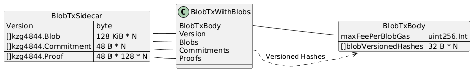
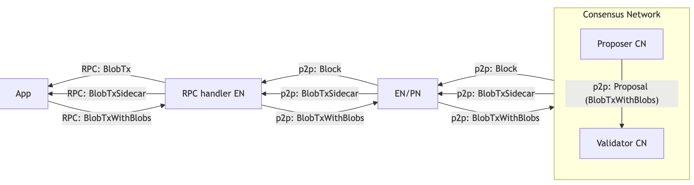

## Abstract

Introduce the Blob transaction type that represents the existence of data blobs, corresponding KZG commitments and proofs. This KIP follows the latest Ethereum Fusaka specs and will be included in Kaia's Osaka Hardfork. Therefore, [EIP-4844](https://github.com/ethereum/EIPs/blob/master/EIPS/eip-4844.md) is the baseline, but also includes the [EIP-7516](https://github.com/ethereum/EIPs/blob/master/EIPS/eip-7516.md) BLOBBASEFEE opcode and [EIP-7594](https://github.com/ethereum/EIPs/blob/master/EIPS/eip-7594.md) cell proof format. The blob per block limit was lowered to fit in Kaia's short 1-second block time. Since the limit is low, the target gas mechanism was removed for simplicity.

## Motivation

Kaia wants to accommodate rollups for scalability and specialized features in L2 chains. Rollups typically need to upload their summary data onto L1 which incurs a high data load. For instance, if an L2 submits a 128 KB blob every 10 seconds, the chain receives 33 GB a month and pays 33,000 KAIA. With this KIP, the L2 can post its data through [EIP-4844 compatible blob transactions to provide cost-effective and scalable](https://docs.arbitrum.io/how-arbitrum-works/inside-arbitrum-nitro) method. As the blockchain can be free from the burden of persisting the calldata, the chain can offer a lower pricing.

## Specification

### Parameter

**Type parameters**

| Parameter | Value | Note |
|-|-|-|
| `BLOB_TX_TYPE` | `0x03` | For Ethereum compatible RLP |
| `TxTypeEthereumBlob` | `0x7803` | For Kaia consensus RLP |
| `VERSIONED_HASH_VERSION_KZG` | `0x01` | Prefixed to `BlobVersionedHash` |
| `BlobSidecarVersionV1` | `0x01` | The sidecar_version of `BlobTxWithBlobsV1` |

**Blob size parameters**

| Parameter | Value | Note |
|-|-|-|
| `BYTES_PER_FIELD_ELEMENT` | 32 | (byte/elem) |
| `FIELD_ELEMENTS_PER_BLOB` | 4096 | (elem/blob) |
| `BYTES_PER_BLOB` | `BYTES_PER_FIELD_ELEMENT * FIELD_ELEMENTS_PER_BLOB` = 131072 | 128 KB
| `GAS_PER_BLOB` | 131072 | (blobgas/blob). 1 blobgas/byte |
| `MAX_BLOB_GAS_PER_BLOCK` | 131072 | max 1 blob/block |
| `MIN_BASE_FEE_PER_BLOB_GAS` | 300000000000 | 300 gkei/blobgas |
| `BLOB_SIDECARS_RETENTION` | 1814400 | 21 days in blocks |

**Cell proof parameters**

| Parameter | Value | Note |
|-|-|-|
| `FIELD_ELEMENTS_PER_EXT_BLOB` | `2 * FIELD_ELEMENTS_PER_BLOB` = 8192 | (elem/extblob) |
| `FIELD_ELEMENTS_PER_CELL` | 64 | (elem/cell) |
| `BYTES_PER_CELL` | `FIELD_ELEMENTS_PER_CELL * BYTES_PER_FIELD_ELEMENT` = 2048 | (byte/cell) |
| `CELLS_PER_EXT_BLOB` | `FIELD_ELEMENTS_PER_EXT_BLOB // FIELD_ELEMENTS_PER_CELL` = 128 | (cell/extblob) |

**Data types**

| Type | Definition |
|-|-|
| `kzg4844.Blob` | `[BYTES_PER_BLOB]byte` = `[131072]byte` |
| `kzg4844.Commitment` | `[48]byte` |
| `kzg4844.Proof` | `[48]byte` |
| `BlobVersionedHash` | `[32]byte` = `0x01 + hash(commitment)[1:]` |



### Blob transaction

The transaction fields are identical to the EIP-4844 definition.

```js
TransactionPayloadBody = [chain_id, nonce, max_priority_fee_per_gas, max_fee_per_gas, gas_limit, to, value, data, access_list, max_fee_per_blob_gas, blob_versioned_hashes, y_parity, r, s]
```

All fields follow the same semantics as EIP-4844. Note that the `to` field cannot be `nil` and always be an address.

### Block header

The block header is extended with two new fields blob_gas_used and excess_blob_gas.

```py
class Header:
	parentHash:   hash
	rewardbase:   address
	root:         hash
	txHash:       hash
	receiptHash:  hash
	bloom:        bloom
	blockScore:   bigint
	number:       bigint
	gasUsed:      uint64
	time:         bigint
	timeFoS:      uint8
	extra:        bytes
	governance:   bytes
	vote:         bytes

	baseFee:      int   # since Magma, as per KIP-71

	randomReveal: bytes # since Randao, as per KIP-114
	mixHash:      bytes # since Randao, as per KIP-114

	blobGasUsed:   uint64 # since Osaka, as per KIP-279
	excessBlobGas: uint64 # since Osaka, as per KIP-279
```

### Networking

There are multiple network representations. BlobTx and BlobSidecar travel through the network of nodes in various forms.

```js
BlobTxRLP = 0x7803 || rlp(TransactionPayloadBody)
EthBlobTxRLP = 0x03 || rlp(TransactionPayloadBody)
BlobTxSidecar = rlp([sidecar_version, blobs, commitments, cellProofs])
BlobTxWithBlobs = rlp([TransactionPayloadBody, sidecar_version, blobs, commitments, proofs]
```

The Kaia chain internally processes the RLP encoding prefixed with `TxTypeEthereumBlob (0x7803)`. But for Ethereum compatibility, a Kaia node MAY return an RLP encoding prefixed with `BLOB_TX_TYPE (0x03)`.

**Sidecar format**

- Both BlobTxSidecar and BlobTxWithBlobs MUST include a `sidecar_version` field before the blobs field. The version field is also referred to as `wrapper_version`.
- The sidecar version MUST be `BlobSidecarVersionV1 (0x01)` as per EIP-7594.
- There MUST be `CELLS_PER_EXT_BLOB (128)` proofs (i.e. cell proofs) for each blob as per EIP-7594.

**Propagate BlobTxWithBlobs**

- An RPC endpoint node, MAY accept a `BlobTxWithBlobs` via its `eth_sendRawTransaction` and `kaia_sendRawTransaction` JSON-RPC API.
- A node SHOULD accept a `BlobTxWithBlobs` via its p2p `TxMsg`.
- When a node receive a `BlobTxWithBlobs` via RPC or p2p, it MUST be validated, then propagated to its peers like any other transactions in the txpool.

**Consensus**

- When a block proposer decides to include a `BlobTx`, the proposer MUST assure that the originating `BlobTxWithBlobs` is verified.
- Block proposals SHOULD include the `BlobTxWithBlobs` so validators can verify it.
- Validators MUST assure that the `BlobTxWithBlobs` is verified *before committing to the block*. Note that verifying a `BlobTxWithBlobs` does not require block execution.
- As a result, whenever you see a `BlobTx` in a finalized block, you are sure that there exists a corresponding `BlobTxSidecar` because you trust the CNs' consensus.

**Persist BlobTxSidecar**

- When a node receive a finalized block with `BlobTx` inside, the node SHOULD persist the corresponding `BlobTxSidecar`.
  - The `BlobTxSidecar` can come from the `BlobTxWithBlobs` in the node's txpool memory.
  - The `BlobTxSidecar` can come from the peer over p2p.
- Nodes MAY request peers for `BlobTxSidecars` in `BlobSidecarsRequestMsg = 0x15` p2p message. In turn, nodes SHOULD respond peers with `BlobTxSidecars` in `BlobSidecarsMsg = 0x16` p2p message, if available.
- Nodes SHOULD NOT request peers for `BlobTxSidecars` whose block number is older than `BLOB_SIDECARS_RETENTION` before the known head block.
- Nodes MAY delete the `BlobTxSidecar` whose block number is older than `BLOB_SIDECARS_RETENTION` before the head block.



### BlobTxWithBlobs validation

Upon receiving a `BlobTxWithBlobs` via RPC or p2p, it is verified as follows.

1. The `BlobTxWithBlobs` format complies with EIP-7594.
  ```py
  tx, sidecar_version, blobs, commitments, proofs = blobTxWithBlobs
  assert sidecar_version == 1  # BlobSidecarVersionV1
  assert len(tx.blobVersionedHashes) == len(blobs) == len(commitments)  # 1 commitment per blob
  assert len(blobs) * CELLS_PER_EXT_BLOB == len(proofs)  # 128 proofs per blob
  ```
2. The `BlobTxWithBlobs` contains the correct proofs
  ```py
  for i in range(len(tx.blobVersionedHashes)):
    assert CalcBlobHashV1(commitments[i]) == tx.blobVersionedHashes[i]
  assert VerifyCellProofs(blobs, commitments, cellProofs)
  ```

A `BlobTxWithBlobs` verification happens in these situations:
- Receive via `eth_sendRawTransaction` RPC
- Receive via [`TxMsg` p2p message](https://github.com/kaiachain/kaia/blob/v2.1.0/node/cn/protocol.go)
- Receive via [`IstanbulMsg` p2p message](https://github.com/kaiachain/kaia/blob/v2.1.0/consensus/istanbul/backend/handler.go)'s [Proposal payload](https://github.com/kaiachain/kaia/blob/v2.1.0/consensus/istanbul/types.go). Note that the `type Proposal interface` is instantiated as `*types.Block` which includes the transactions inside. Since a `BlobTxWithBlobs` is treated as a transaction, the Proposal should naturally include Sidecars.

### Block validation

A valid block must satisfy the following conditions. Note that the authenticity of the `tx.blobVersionedHashes` is not verified here because we assume that consensus nodes validated them against `BlobTxSidecar`.

Rules below are similar to the EIP-4844 'Execution layer validation' specification, except the `baseFeePerBlobGas` calculation.

1. `header.excessBlobGas` equals the value calculated from the parent header.
  ```py
  def calcExcessBlobGas(parent: Header) -> int:
    return max(0, parent.excessBlobGas + parent.blobGasUsed - TARGET_BLOB_GAS_PER_BLOCK)
  assert block.header.excessBlobGas == calcExcessBlobGas(block.parent.header)
  ```
2. For each BlobTx, the sender has enough balance to fund both execution gas and blob gas.
  ```py
  for tx in block.transactions:
    ...
    max_execution_fee = tx.gas * tx.maxFeePerGas
    max_blob_fee = len(tx.blobVersionedHashes) * GAS_PER_BLOB * tx.maxFeePerBlobGas
    assert signer(tx).balance >= max_execution_fee + max_blob_fee
    ...
  ```
3. For each BlobTx, there is at least one blob versioned hash with the correct version.
  ```py
  for tx in block.transactions:
    ...
    if tx.type == BLOB_TX_TYPE:
      assert len(tx.blobVersionedHashes) > 0
      for h in tx.blobVersionedHashes:
        assert h[0] == VERSIONED_HASH_VERSION_KZG
    ...
  ```
4. For each BlobTx, `tx.maxFeePerBlobGas` is at least the calculated `baseFeePerBlobGas`.
  ```py
  baseFeePerBlobGas = MIN_BASE_FEE_PER_BLOB_GAS
  for tx in block.transactions:
    if tx.type == BLOB_TX_TYPE:
      assert tx.maxFeePerBlobGas >= baseFeePerBlobGas
  ```
5. `header.blobGasUsed` is correctly calculated from the transactions and is below the limit.
  ```py
  blobGasUsed = 0
  for tx in block.transactions:
    if tx.type == BLOB_TX_TYPE:
      blobGasUsed += len(tx.blobVersionedHashes) * GAS_PER_BLOB
  assert block.header.blobGasUsed == blobGasUsed
  assert block.header.blobGasUsed <= MAX_BLOB_GAS_PER_BLOCK
  ```

### Opcodes

The `BLOBHASH (0x49)` opcode was introduced to the Kaia chain with the Cancun hardfork, but it has been returning a zero hash. Its behavior MUST change to take in one integer argument index and return `tx.blob_versioned_hashes[index]`. Its gas cost `3` stay the same.

The `BLOBBASEFEE (0x4a)` opcode was introduced to the Kaia chain with the Cancun hardfork, but it has been returning 0. Its behavior MUST change to return the blob base fee of the current block it is executing in. Its gas cost `2` MUST stay the same.

### Precompile

The `POINT_EVALUATION_PRECOMPILE (0x0a)` was introduced to the Kaia chain with the Cancun hardfork, and it does not change.

## API

#### eth_sendRawTransaction, kaia_sendRawTransaction

eth_sendRawTransaction and kaia_sendRawTransaction accepts a `BlobTxWithBlobs`. It MUST NOT accept `BlobTx` without the sidecar.

#### eth_getRawTransaction, kaia_getRawTransaction

eth_getRawTransaction returns the raw transaction RLP prefixed with `BLOB_TX_TYPE (0x03)`. kaia_getRawTransaction returns the raw transaction RLP prefixed with `TxTypeEthereumBlob (0x7803)`. Both APIs never return `BlobTxWithBlobs`.

#### eth_getBlock, eth_getTransaction, eth_getTransactionReceipt

These eth namespace APIs that return transaction fields MUST show the `maxFeePerBlobGas` and `blobVersionedHashes` fields, and its `type: "0x03"`.

#### kaia_getBlock, kaia_getTransaction, kaia_getTransactionReceipt

These kaia namespace APIs that return transaction fields MUST show the `maxFeePerBlobGas` and `blobVersionedHashes` fields, and its `typeInt: 30723`, and `type: "TxTypeEthereumBlob"`.

#### eth_getBlobSidecars

A new JSON-RPC API `eth_getBlobSidecars` returns the stored `BlobTxSidecars` associated with the `BlobTx`s in the specified block. An empty array is returned if the block does not contain any `BlobTx`. An error is returned if the block has some `BlobTx` but any of the associated `BlobTxSidecars` are unavailable in the RPC node, e.g. deleted by expiration or didn't receive from peers.

- Parameters:
  - `number` - integer or hexadecimal block number, or the string tags such as "pending", "latest".
  - `fullBlob` - If true, returns the full blob data. Otherwise, return up to the first 32 bytes of each blob. False by default.
- Returns:
  - An array of:
    - `blobSidecar` - A sidecar object
      - `version` - The `sidecar_version` in integer
      - `blobs` - An array of blobs in hex strings
      - `commitments` - An array of commitments in hex strings
      - `proofs` - An array of proofs in hex strings
    - `blockHash` - The hash of the block the blob is included
    - `blockNumber` - The number of the block the blob is included
    - `txHash` - The hash of the transaction the blob is included
    - `txIndex` - The index of the transaction the blob is included
- Example
  ```sh
  curl http://localhost:8551 -X POST -H "Content-Type: application/json" \
    --data '{"jsonrpc":"2.0", "id":1, "method":"eth_getBlobSidecars", "params":["0x1234",false]}' \
  ```
  ```json
  {
    "jsonrpc": "2.0",
    "id": 1,
    "result": [
      {
        "blobSidecar": {
          "version": 1,
          "blobs": [
            "0x61c47a49eb50be125fa6c05e1bc9f3eb1c7c555bddd93d8fc1be4d0bff6cae32"
          ],
          "commitments": [
            "0x90b049b9255bf13b96c226a1ec1a3dac0deac6533b55378c846e91839000ddc31a662afdfc489694add406846cfeefbf"
          ],
          "proofs": [
            "0xb4104a0b89b4a302c44c753560fae156107746edc98ce81c91d7045490eebee984bd9d96648bad6ff1454643ad00d2e1"
          ]
        },
        "blockHash": "0x1d67a5039edec9296a3f5935111da5b712df541905ff6ce9f3581d3bc7a1afbd",
        "blockNumber": "0xc0f6b6b",
        "txHash": "0xbb7376baf28c7a1698729ce91266ac82652281704fe217e0b5a5ef968e62b169",
        "txIndex": "0x1",
      }
    ]
  }
  ```

#### eth_getBlobSidecarByTxHash

A new JSON-RPC API `eth_getBlobSidecarByTxHash` returns the stored `BlobTxSidecars` associated with the specified `BlobTx`. An error is returned if the transaction does not exist or is not a BlobTx type. An error is returned if the transaction is a `BlobTx` but the associated `BlobTxSidecars` are unavailable in the RPC node, e.g. deleted by expiration or didn't receive from peers.


- Parameters:
  - `txHash` - The hash of the blob transaction.
  - `fullBlob` - If true, returns the full blob data. Otherwise, return up to the first 32 bytes of each blob. False by default.
- Returns:
  - `blobSidecar` - A sidecar object
    - `version` - The `sidecar_version` in integer
    - `blobs` - An array of blobs in hex strings
    - `commitments` - An array of commitments in hex strings
    - `proofs` - An array of proofs in hex strings
  - `blockHash` - The hash of the block the blob is included
  - `blockNumber` - The number of the block the blob is included
  - `txHash` - The hash of the transaction the blob is included
  - `txIndex` - The index of the transaction the blob is included
  - Example
    ```sh
    curl http://localhost:8551 -X POST -H "Content-Type: application/json" \
      --data '{"jsonrpc":"2.0", "id":1, "method":"eth_getBlobSidecarByTxHash", "params":["0xbb7376baf28c7a1698729ce91266ac82652281704fe217e0b5a5ef968e62b169",false]}' \
    ```
    ```json
    {
      "jsonrpc": "2.0",
      "id": 1,
      "result": {
        "blobSidecar": {
          "version": 1,
          "blobs": [
            "0x61c47a49eb50be125fa6c05e1bc9f3eb1c7c555bddd93d8fc1be4d0bff6cae32"
          ],
          "commitments": [
            "0x90b049b9255bf13b96c226a1ec1a3dac0deac6533b55378c846e91839000ddc31a662afdfc489694add406846cfeefbf"
          ],
          "proofs": [
            "0xb4104a0b89b4a302c44c753560fae156107746edc98ce81c91d7045490eebee984bd9d96648bad6ff1454643ad00d2e1"
          ]
        },
        "blockHash": "0x1d67a5039edec9296a3f5935111da5b712df541905ff6ce9f3581d3bc7a1afbd",
        "blockNumber": "0xc0f6b6b",
        "txHash": "0xbb7376baf28c7a1698729ce91266ac82652281704fe217e0b5a5ef968e62b169",
        "txIndex": "0x1",
      }
    }
    ```

## Rationale

### Blob gas fee

Consider the long-term infrastructure costs of accepting a blob-sized data into blockchain as calldata and blob. Assuming a 128 KB blob is constantly added every block (every second). Over a month, about 330GB of data via 2,600,000 blocks. Over a year, 4,000GB via 31,000,000 blocks.

There could be two ways to post blob data to blockchain.

- Storing in calldata: Send a regular transaction (e.g. type 0 LegacyTx or type 2 DynamicFeeTx) with calldata filled with 128 KB data.
- Sending BlobTx: Send a type 3 BlobTxWithBlobs. Its size is 134 KB as it includes 128 cell proofs.

Estimate the computation, storage, and network costs for both methods.

- Computing cost mainly consist of KZG proof verification
  - Large calldata itself does not incur EVM execution.
  - According to the estimation in [EIP-7918](https://github.com/ethereum/EIPs/blob/master/EIPS/eip-7918.md), batch-verifying `CELLS_PER_EXT_BLOB (128)` proofs costs roughly 15 times the `POINT_EVALUATION_PRECOMPILE (50000 gas)`. i.e. Verifying a blob costs about 750,000 gas.
- Storage cost is estimated as the cloud disk cost of 50 consensus nodes to persist the data
  - Currently, calldata are indefinitely persisted. In the future, [EIP-4444 might](https://eips.ethereum.org/EIPS/eip-4444) be implemented so nodes store 1 year’s worth of data. i.e., large calldata constantly takes up 4,000 GB. We assume EIP-4444 in this calculation.
  - With BlobTx, 21 days’ worth of data is constantly persisted. It calculates to 240GB.
  - AWS Singapore region, EBS gp3 is priced at 0.096 USD per GB per month.
- Network cost is estimated as the cloud data transfer cost of a proposer sending the data to 50 consensus nodes every block.
  - In both methods, the proposal includes the data as block body.
  - AWS Singapore region, Outbound transfer to Internet priced at 0.12 USD per GB
- Gas cost is calculated according to Kaia Prague hardfork rules.
  - Calldata pricing follows KIP-223 and EIP-7623. Assuming the calldata is random, mostly non-zero bytes. Then the floor data gas costs 40 gas per byte.
- Gas fee is calculated at the Mainnet’s lower bound base fee of 25 gkei, and the proposed min blob base fee of 300 gkei.

| Infrastructure cost | 128KB calldata LegacyTx every block | 128KB BlobTx every block |
|-|-|-|
| Storage cost | $19,000 | $1,100 |
| Network cost | $2,000 | $2,100 |
| Infra cost per month | $21,000 | $3,200 |
| **Infra cost per transaction** | $0.0081 | $0.0012 |
| **Computing cost per transaction** | ~0 gas | 750,000 gas |
| Gas cost per transaction | 5,242,880 gas | 131,072 blobgas |
| **Gas fee per transaction** | 0.131 KAIA | 0.0393 KAIA |

Suppose gas fee is proportional to the sum of infrastructure cost and computing cost. Solving the following proportional expression implies that an appropriate gas fee of a blob is 0.038 KAIA.

```
Calldata: Infra $0.0081 + Compute 0 gas    ~ 5,242,880 gas +       0 gas ~  0.131  KAIA
BlobTx:   Infra $0.0012 + Compute 750k gas ~   777,000 gas + 750,000 gas ~ [0.038] KAIA
```

Finally, derive the appropriate the blob base fee.

```
1,527,000 gas * 25 gkei/gas ~ 0.038 KAIA ~ 131,072 blobgas * 290 gkei/blobgas
```

Therefore, `MIN_BASE_FEE_PER_BLOB_GAS` was decided to be 300 gkei, so that BlobTx cost is about 3.4x cheaper than calldata posting.

### Blob capacity

Ethereum blobspace supply is 0.5 blobs/sec since Pectra hardfork's [EIP-7691](https://github.com/ethereum/EIPs/blob/master/EIPS/eip-7691.md) (target 6 blobs per block, 12 second block time). [Ethereum's blobspace utilization is currently at around 60%](https://www.binance.com/en/square/post/24317625438034). Ethereum is planning to reach 1.2 blobs/sec in the future after [EIP-7892 BPO2](https://github.com/ethereum/EIPs/blob/master/EIPS/eip-7892.md) hardfork.

This KIP proposes higher or similar capacity of 1 blobs/sec. This will be sufficient enough to accommodate several L2s.

The network should easily handle 1 blob per block because one blob (134 KB including cell proofs) is much smaller than the [theoretical block size limit of 10 MB](https://github.com/kaiachain/kaia/blob/f882207448f239d2d148e057ca1b950b031d5a46/params/protocol_params.go#L220-L222).

### Simplified fee mechanism

This KIP proposes the max 1 blobs per block (`MAX_BLOB_GAS_PER_BLOCK = 1 * GAS_PER_BLOB`) parameter. Then target blobs, excess blob gas, dynamic blob base fee mechanisms become meaningless. Therefore, `baseFeePerBlobGas` is simply defined as the constant value `MIN_BASE_FEE_PER_BLOB_GAS = 300 gkei/blobgas`.

### Reject sidecar V0

The EIP-4844 defined the blobTxWithBlobs without the version field (V0) that had been used since Dencun Hardfork. Since Fusaka Hardfork, only the new format - with the version field (V1) - will be accepted ([EIP-7607](https://github.com/ethereum/EIPs/blob/master/EIPS/eip-7607.md), [EIP-7594](https://github.com/ethereum/EIPs/blob/master/EIPS/eip-7594.md), [go-ethereum blobpool](https://github.com/ethereum/go-ethereum/blob/2a4847a7d1462cdda375429b447e7162514721e0/core/txpool/blobpool/blobpool.go#L1669)). Since we haven't supported V0, we start with V1 at the beginning of BlobTx in Kaia.

```js
BlobTxWithBlobsV0 = rlp([TransactionPayloadBody, blobs, commitments, proofs]
BlobTxWithBlobsV1 = rlp([TransactionPayloadBody, sidecar_version, blobs, commitments, proofs]
```

### Custom RPC for sidecar retrieval

Ethereum provides the sidecars via its [Beacon API `/eth/v1/beacon/blobs/{block_id}`](https://ethereum.github.io/beacon-APIs/#/Beacon/getBlobs). Since Kaia does not have Beacon API framework, new JSON-RPC APIs `eth_getBlobSidecars` and `eth_getBlobSidecarByTxHash` were added.

## References

- [EIP-4844: Shard Blob Transactions](https://github.com/ethereum/EIPs/blob/master/EIPS/eip-4844.md)
- [EIP-7516: BLOBBASEFEE instruction](https://github.com/ethereum/EIPs/blob/master/EIPS/eip-7516.md)
- [EIP-7594: PeerDAS - Peer Data Availability Sampling](https://github.com/ethereum/EIPs/blob/master/EIPS/eip-7594.md)
- [Ethereum Deneb consensus specs](https://github.com/ethereum/consensus-specs/tree/master/specs/deneb)
- [Ethereum Fulu consensus specs](https://github.com/ethereum/consensus-specs/tree/master/specs/fulu)
- [Kaia BLOBHASH, BLOBBASEFEE, KZG precompile implementation](https://github.com/klaytn/klaytn/pull/2032)
- [Kaia RLP block size limit implemenation](https://github.com/kaiachain/kaia/pull/575)
- [AWS pricing calculator](https://calculator.aws/)
