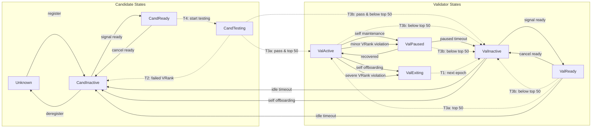

## Abstract

This KIP introduces an automatic state transition framework for candidates and validators in the permissionless Kaia network. It defines 9 states (4 candidate states, 5 validator states) and their allowed transitions, enabling decentralized validator lifecycle management without manual intervention from the Kaia team.

## Motivation

The current Kaia network operates in a permissioned manner where the Kaia team manually manages validator states. As the network transitions to permissionless operation, an automatic state management system becomes necessary.

With KIP-227 introducing VRank for quantitative evaluation of validators, this KIP establishes the state machine that governs:
- How candidates join the network through a VRank testing
- How validators participate in consensus based on stake ranking
- How validators are paused or removed upon VRank violations
- How validators can voluntarily exit or perform maintenance

This framework enables trustless validator lifecycle management while maintaining network stability through structured state transitions.

## Specification

### Parameters

The following parameters are used in this KIP:

| Parameter | Description | Sample Value |
|-----------|-------------|--------------|
| `MaxValidatorCount` | Maximum number of validators across all validator states (ValActive, ValReady, ValInactive, ValPaused, ValExiting) | 100 |
| `ActiveValidatorCount` | Number of top-staked validators that is in `ValActive`, `ValPaused` when epoch starts | 50 |
| `MaxReadyCandidateCount` | Maximum number of candidates that can be in `CandReady` | 3 |
| `MinStake` | Minimum staking amount required to enter the consensus | 5,000,000 KAIA |
| `ValPausedTimeout` | Maximum duration a validator can remain in `ValPaused` before transitioning to `ValInactive` | 8 hours |
| `ValIdleTimeout` | Maximum duration a validator can remain in `ValInactive` or `ValReady` before transitioning to `CandInactive` | 30 days |
| `ValPausedSlotLimit` | Maximum number of validators that can be in `ValPaused` | 2*`F` / 5, where `F` is the byzantine fault tolerance factor |
| `ValInactiveSlotLimit` | Maximum number of validators that can be in `ValInactive` | 2*`F` / 5, where `F` is the byzantine fault tolerance factor |
| `VRankEpoch (Epoch)` | Epoch interval for vrank | 86400 |

### Overview

The framework defines 9 states divided into two categories:

- **Candidate States**: Unknown (placeholder), CandInactive, CandReady, CandTesting
- **Validator States**: ValActive, ValReady, ValInactive, ValPaused, ValExiting

State transitions may occur either **at epoch interval** or **at arbitrary blocks**. Any event that occurred at block `N` and requires a state transition **must take effect starting from block `N+1`**, and all state transitions **must ensure block-level atomicity**. For example, if a validator in `ValActive` state requests a transition to `ValPaused` at block `N`, the validator remains in `ValActive` for all state reads at block `N` and transitions to `ValPaused` starting from block `N+1`.

Only validators in **ValActive** state participate in consensus and receive rewards. The active validator set consists of the top 50 validators by staking amount at the epoch interval block.

### Candidate States

| State | Description |
|-------|-------------|
| Unknown | Conceptual state representing entities not registered in the system. |
| CandInactive | Candidate not ready to participate in VRank testing at the next epoch. |
| CandReady | Candidate has signaled readiness to participate in VRank testing at the next epoch. |
| CandTesting | Candidate undergoing VRank testing to prove infrastructure reliability. |

### Validator States

| State | Description |
|-------|-------------|
| ValActive | Active validator participating in consensus and earning rewards (= committee). Must be in top 50 by staking amount. |
| ValReady | Validator has signaled readiness to become `ValActive`. Waiting for top 50 position. |
| ValInactive | Inactive validator not participating in consensus. Need to signal readiness or exit to avoid timeout. |
| ValPaused | Validator in maintenance/recovery mode. May be voluntary or forced by VRank violation. |
| ValExiting | Transitional state for current epoch. Becomes `ValInactive` at next epoch. |

### State Transitions

State transitions are categorized by timing:
- **Epoch Interval**: Evaluated and executed when the new epoch starts only
- **Anytime**: Can occur immediately upon transaction during any block

### Transition Conditions

The `User tx` is a transaction initiated by the user, while `System tx` is a system operation initiated by the core client, which follows the same convention as [EIP-4788](https://eips.ethereum.org/EIPS/eip-4788).

#### Registration & Deregistration

| From | To | Timing | Condition | Trigger |
|------|-----|--------|-----------|---------|
| Unknown | CandInactive | Anytime | - | User tx |
| CandInactive | Unknown | Anytime | - | User tx |

#### Candidate Lifecycle

| From | To | Timing | Condition | Trigger |
|------|-----|--------|-----------|---------|
| CandInactive | CandReady | Anytime | Over `MinStake` AND `CandReady count < MaxReadyCandidateCount` AND `Val* count + CandReady count + CandTesting count < MaxValidatorCount` | User tx |
| CandReady | CandInactive | Anytime | - | User tx |
| CandReady | CandTesting | Epoch | Over `MinStake` | System tx |
| CandTesting | CandInactive | Epoch | Failed VRank evaluation | System tx |
| CandTesting | ValActive | Epoch | Pass VRank AND Top 50 by stake | System tx |
| CandTesting | ValInactive | Epoch | Pass VRank AND Below Top 50 | System tx |

#### Validator Active Set

| From | To | Timing | Condition | Trigger |
|------|-----|--------|-----------|---------|
| ValActive | ValInactive | Epoch | Below Top 50 by stake | System tx |
| ValInactive | ValReady | Anytime | Over `MinStake` | User tx |
| ValReady | ValInactive | Anytime | - | User tx |
| ValReady | ValInactive | Epoch | Below Top 50 by stake | System tx |
| ValReady | ValActive | Epoch | Top 50 by stake | System tx |

#### Maintenance & Recovery

| From | To | Timing | Condition | Trigger |
|------|-----|--------|-----------|---------|
| ValActive | ValPaused | Anytime | `ValPaused count < ValPausedSlotLimit` AND request by self for maintenance | User tx |
| ValActive | ValPaused | Anytime | `ValPaused count < ValPausedSlotLimit` AND caught by minor VRank violation | System tx |
| ValPaused | ValActive | Anytime | - | User tx |
| ValPaused | ValInactive | Anytime | `paused duration >= ValPausedTimeout` | User tx |
| ValPaused | ValInactive | Epoch | Below Top 50 by stake | System tx |

#### Exit & Offboarding

| From | To | Timing | Condition | Trigger |
|------|-----|--------|-----------|---------|
| ValActive | ValExiting | Anytime | `ValExiting count < ValExitingSlotLimit` AND request by self for offboarding | User tx |
| ValActive | ValExiting | Anytime | `ValExiting count < ValExitingSlotLimit` AND caught by severe VRank violation | System tx |
| ValExiting | ValInactive | Epoch | - | System tx |
| ValReady | CandInactive | Anytime | `idle duration >= ValIdleTimeout` | System tx |
| ValInactive | CandInactive | Anytime | `idle duration >= ValIdleTimeout` | System tx |
| ValInactive | CandInactive | Anytime | - | User tx |

### Epoch Transition

Epoch transitions occur at the start of the first block of the next epoch (`block.number % VRankEpoch == 0`), as part of the block processing logic. It means the epoch transition for `[N, N+VRankEpoch-1]` epoch is executed at the start of `N+VRankEpoch` block. The following pseudo code defines the transition ordering:

```python
def process_epoch_transition():
    # T1: Clear transitional states
    for validator in get_validators_by_state(ValExiting):
        transition(validator, ValInactive)

    # T2: Evaluate VRank for candidates in testing
    # Failed candidates return to CandInactive, passed candidates are marked for promotion
    passed_candidates = []
    for candidate in get_candidates_by_state(CandTesting):
        if not passed_vrank(candidate):
            transition(candidate, CandInactive)
        else:
            passed_candidates.append(candidate)

    # Build eligible validator pool for top 50 calculation
    # Pool includes: current active, ready, paused validators, and passed candidates
    # Exclude any entity with stake below MinStake
    eligible_pool = [v for v in (
        *get_validators_by_state(ValActive),
        *get_validators_by_state(ValReady),
        *get_validators_by_state(ValPaused),
        *passed_candidates
    ) if v.stake >= MinStake]

    # Determine top 50 by stake
    eligible_pool.sort(key=lambda v: v.stake, reverse=True)
    top50 = set(eligible_pool[:ActiveValidatorCount])

    # T3a: Promote to ValActive (entities in top 50)
    for entity in eligible_pool:
        if entity in top50:
            if entity.state == ValReady:
                transition(entity, ValActive)
            elif entity.state == CandTesting:  # passed VRank
                transition(entity, ValActive)
            # ValActive stays ValActive
            # ValPaused stays ValPaused (requires voluntary recovery)

    # T3b: Demote to ValInactive (entities below top 50)
    for entity in eligible_pool:
        if entity not in top50:
            if entity.state == ValActive:
                transition(entity, ValInactive)
            elif entity.state == ValPaused:
                transition(entity, ValInactive)
            elif entity.state == CandTesting:  # passed VRank but not top 50
                transition(entity, ValInactive)
            elif entity.state == ValReady:
                transition(entity, ValInactive)

    # T4: Start new testing period for ready candidates
    for candidate in get_candidates_by_state(CandReady):
        if candidate.stake >= MinStake:
            transition(candidate, CandTesting)
```

**Ordering Rationale:**

1. **T1 (ValExiting → ValInactive)**: Clear exiting validators first to free up slots and ensure they don't affect top 50 calculation.

2. **T2 (CandTesting evaluation)**: Evaluate VRank before calculating top 50 since passed candidates become eligible for the active set.

3. **T3a (Promote to ValActive)**: Entities in top 50 are promoted. `ValReady` and passed `CandTesting` transition to `ValActive`. `ValPaused` stays paused (recovery is voluntary).

4. **T3b (Demote to ValInactive)**: Entities below top 50 are demoted. `ValActive`, `ValPaused`, and passed `CandTesting` transition to `ValInactive`. `ValReady` stays ready.

5. **T4 (CandReady → CandTesting)**: Start testing last, after all other transitions are complete, so new testers don't affect the current epoch's calculations.

The following diagram illustrates all valid state transition paths:



- **Solid arrows**: Anytime transitions
- **Dotted arrows**: Epoch interval transitions

> **Note**: Any state transition not specified above is ILLEGAL and must be rejected by the protocol.

## Rationale

### State transition timing

Without ensuring block-level atomicity, in the same block, a node can have different state by transaction ordering. For example, given transaction ordering, `tx0` and `tx2` will have different states.

```plaintext
block N:
  tx0: read  validator.state = ValActive
  tx1: write validator.state = ValPaused (transition to ValPaused)
  tx2: read  validator.state = ValPaused (should be ValActive still)
```

### Penalty for VRank violation

Currently, the penalty for VRank violation is temporary (`ValPaused`) or permanent (`ValExiting`) based on the severity. This will affect to reward suspension but not slashing or extending the lockup period, which is more direct penalty. During the permissionless transition, we'd expect many validators requires enough onboarding period to operate validator node smoothly. If we enforce strict penalty from the early stage, it can lead to many validators being offboarded, which is not desirable and eventually lead to network instability. To prevent this and ensure enough transition period, we came up with current transition conditions. After the permissionless transition, if it turns out that current penalty is not sufficient, we can introduce more strict penalty such as slashing.

### `ValInactive` state

With nature of BFT-based consensus (we have room for upgrade), we need appropriate number of validators to operate the network. Without competition model, we can't expect any new validators to join the network when the `ValActive` slot is full. To activate the staking competition while keeping the network stable, we introduced the intermediate state `ValInactive` to allow validators under the top 50 by stake to have enough time to stake more KAIA and join the network.

### `ValExiting` state

If a validator wants to exit the network, it can voluntarily submit a request to make itself `ValExiting` state, and stop participating in the consensus. After the next epoch, it'll be automatically transitioned to `ValInactive` state, which can be offboarded freely. This is to ensure not rapidly offboarding validators, which can lead to network instability. If we directly offboard the validator, it's hard to restrict the number of offboarded (= `ValExiting` state) validators.

### Timeout and Slot limit for `ValInactive` and `ValPaused`

The timeout and slot limit for `ValInactive` and `ValPaused` is to ensure the validator is not taking up the slot permanently. For example, if a new node client with Hardfork has been released, all validators should update their node client before the Hardfork. But if there no timeout, it's possible that some validators cannot update their node client. It's also critical that too many active validators to request `ValPaused` or `ValExiting` at the same time, which can lead to network instability.

## Backwards Compatibility

This KIP introduces a new framework for candidate and validator state and all participants must follow the rules defined in this KIP.

## References

- [KIP-227: Candidate and Validator Evaluation](https://github.com/kaiachain/kips/pull/27) - Defines VRank criteria and evaluation rules
- [EIP-4788: System Transactions](https://eips.ethereum.org/EIPS/eip-4788) - Defines system transaction convention

## Copyright

Copyright and related rights waived via [CC0](https://creativecommons.org/publicdomain/zero/1.0/).
