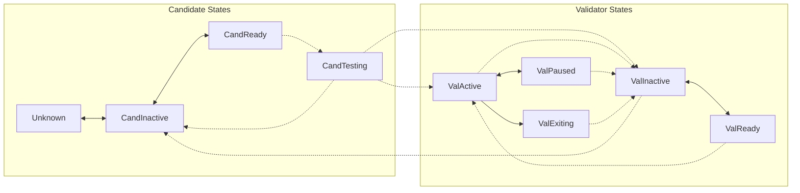

## Abstract

This KIP introduces an automatic state transition framework for candidates and validators in the permissionless Kaia network. It defines 9 states (4 candidate states, 5 validator states) and their allowed transitions, enabling decentralized validator lifecycle management without manual intervention from the Kaia team.

## Motivation

The current Kaia network operates in a permissioned manner where the Kaia team manually manages validator states. As the network transitions to permissionless operation, an automatic state management system becomes necessary.

With KIP-227 introducing VRank for quantitative evaluation of validators, this KIP establishes the state machine that governs:
- How candidates join the network through a VRank testing period
- How validators participate in consensus based on stake ranking
- How validators are paused or removed upon VRank violations
- How validators can voluntarily exit or perform maintenance

This framework enables trustless validator lifecycle management while maintaining network stability through structured state transitions.

## Specification

### Overview

The framework defines 9 states divided into two categories:

- **Candidate States**: Unknown (placeholder), CandInactive, CandReady, CandTesting
- **Validator States**: ValActive, ValReady, ValInactive, ValPaused, ValExiting

State transitions occur either **at epoch intervals** (evaluated at epoch boundaries) or **anytime** (immediate upon transaction).

Only validators in **ValActive** state participate in consensus and receive rewards. The active validator set consists of the top 50 validators by staking amount.

### Candidate States

| State | Description |
|-------|-------------|
| Unknown | Conceptual state representing entities not registered in the system. |
| CandInactive | Candidate not ready for VRank testing. |
| CandReady | Candidate has signaled readiness to enter VRank testing at the next epoch. |
| CandTesting | Candidate undergoing VRank evaluation period to prove infrastructure reliability. |

### Validator States

| State | Description |
|-------|-------------|
| ValActive | Active validator participating in consensus and earning rewards (= committee). Must be in top 50 by staking amount. |
| ValReady | Validator has signaled readiness to join active set. Waiting for top 50 position. |
| ValInactive | Inactive validator not participating in consensus. |
| ValPaused | Validator in maintenance/recovery mode. May be voluntary or forced by VRank violation. |
| ValExiting | Transitional state for current epoch. Becomes ValInactive at next epoch. |

### State Transitions

State transitions are categorized by timing:
- **Epoch Interval**: Evaluated and executed at epoch boundaries only
- **Anytime**: Can occur immediately upon transaction during any block

The following diagram illustrates all valid state transitions:

- **Solid arrows**: Anytime transitions
- **Dotted arrows**: Epoch interval transitions

> **Note**: Any state transition not specified above is ILLEGAL and must be rejected by the protocol.

### Parameters

The following parameters are configurable:

| Parameter | Description | Sample Value |
|-----------|-------------|--------------|
| `MaxValidatorCount` | Maximum number of validators across all validator states (ValActive, ValReady, ValInactive, ValPaused, ValExiting) | 100 |
| `ActiveValidatorCount` | Number of top-staked validators that can be in ValActive | 50 |
| `MinStake` | Minimum staking amount required to enter the consensus | 5,000,000 KAIA |
| `ValPausedTimeout` | Maximum duration a validator can remain in ValPaused before transitioning to ValInactive | 8 hours |
| `ValInactiveTimeout` | Maximum duration a validator can remain in ValInactive before transitioning to CandInactive | 30 days |
| `ValPausedSlotLimit` | Maximum number of validators that can be in ValPaused | 2*`F` / 5, where `F` is the byzantine fault tolerance factor |
| `ValInactiveSlotLimit` | Maximum number of validators that can be in ValInactive | 2*`F` / 5, where `F` is the byzantine fault tolerance factor |

### Transition Conditions

#### Registration & Deregistration

| From | To | Timing | Condition |
|------|-----|--------|-----------|
| Unknown | CandInactive | Anytime | - |
| CandInactive | Unknown | Anytime | - |

#### Candidate Lifecycle

| From | To | Timing | Condition |
|------|-----|--------|-----------|
| CandInactive | CandReady | Anytime | Stake more than `MinStake` AND validator number is less than `MaxValidatorCount` |
| CandReady | CandInactive | Anytime | - |
| CandReady | CandTesting | Epoch | Stake more than `MinStake` |
| CandTesting | CandInactive | Epoch | Failed VRank evaluation |
| CandTesting | ValActive | Epoch | Pass VRank AND Top 50 by stake |
| CandTesting | ValInactive | Epoch | Pass VRank AND Below Top 50 |

#### Validator Active Set

| From | To | Timing | Condition |
|------|-----|--------|-----------|
| ValActive | ValInactive | Epoch | Below Top 50 by stake |
| ValInactive | ValReady | Anytime | Stake more than `MinStake` |
| ValReady | ValInactive | Anytime | - |
| ValReady | ValActive | Epoch | Top 50 by stake |

#### Maintenance & Recovery

| From | To | Timing | Condition |
|------|-----|--------|-----------|
| ValActive | ValPaused | Anytime | ValPaused slot is available AND (Maintenance OR Recovery from minor VRank violation) |
| ValPaused | ValActive | Anytime | - |
| ValPaused | ValInactive | Epoch | Timeout OR Below Top 50 by stake |

#### Exit & Offboarding

| From | To | Timing | Condition |
|------|-----|--------|-----------|
| ValActive | ValExiting | Anytime | ValExiting slot is available AND severe VRank violation |
| ValExiting | ValInactive | Epoch | Automatic at next epoch |
| ValInactive | CandInactive | Epoch | Timeout OR Voluntary offboard |

## Rationale

### Penalty for VRank violation

Currently, the penalty for VRank violation is temporary (`ValPaused`) or permanent (`ValExiting`) based on the severity. This will affect to reward suspension but not slashing or extending the lockup period, which is more direct penalty. During the permissionless transition, we'd expect many validators requires enough onboarding period to operate validator node smoothly. If we enforce strict penalty from the early stage, it can lead to many validators being offboarded, which is not desirable and eventually lead to network instability. To prevent this and ensure enough transition period, we came up with current transition conditions. After the permissionless transition, if it turns out that current penalty is not sufficient, we can introduce more strict penalty such as slashing.

### `ValExiting` state

If a validator wants to exit the network, it can voluntarily submit a request to make itself `ValExiting` state, and stop participating in the consensus. After the next epoch, it'll be automatically transitioned to `ValInactive` state, which can be offboarded freely. This is to ensure not rapidly offboarding validators, which can lead to network instability. If we directly offboard the validator, it's hard to restrict the number of offboarded (= `ValExiting` state) validators.

### Timeout and Slot limit for `ValInactive` and `ValPaused`

The timeout and slot limit for `ValInactive` and `ValPaused` is to ensure the validator is not taking up the slot permanently. For example, if a new node client with Hardfork has been released, all validators should update their node client before the Hardfork. But if there no timeout, it's possible that some validators cannot update their node client. It's also critical that too many active validators to request `ValPaused` or `ValExiting` at the same time, which can lead to network instability.

## Backwards Compatibility

This KIP introduces a new framework for candidate and validator state and all participants must follow the rules defined in this KIP.

## References

- [KIP-227: Candidate and Validator Evaluation](https://github.com/kaiachain/kips/pull/27) - Defines VRank criteria and evaluation rules

## Copyright

Copyright and related rights waived via [CC0](https://creativecommons.org/publicdomain/zero/1.0/).
