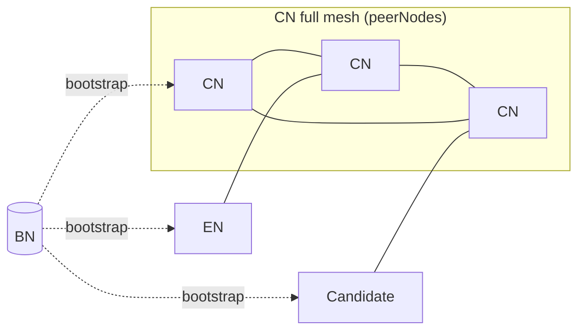

## Abstract

This KIP specifies the P2P network topology and peer-admission rules that Consensus Nodes (CN), Endpoint Nodes (EN), and the bootstrap node (BN) MUST follow after the permissionless hard fork.
It defines the target network shape (a CN full mesh, with ENs connecting directly to CNs and all node types bootstrapped through a unified BN), the three-layer protocol stack (Node Discovery, RLPx, Kaia P2P), and the policies for each node role.
CN admission is governed by the on-chain validator state defined in [KIP-286](./kip-286.md) and [KIP-290](./kip-290.md): only validators whose `AddressBookV2` state lies in a well-defined `peerNodes` set are accepted as CN peers.
The Proxy Node (PN) role is retired: existing PN deployments remain operational for backwards compatibility but MAY be deprecated without notice.

## Motivation

In the pre-fork Kaia P2P network, CN addresses are registered to CNBN through a manual process: operators edit configuration and call RPCs such as `PutAuthorizedNodes` to keep CNBN's allowlist in sync with the current validator set.
ENs do not connect to CNs directly — they reach the consensus network through PNs (Proxy Nodes), which sit between the CN mesh and end-user traffic and are themselves discovered via ENBN.
This arrangement works because the validator set is permissioned and rarely changes, so manual curation is tractable.

Permissionless operation changes three things at once, and the P2P layer has to accommodate all three:

- **CNs self-register.** Validators join and leave through the on-chain lifecycle defined in [KIP-286](./kip-286.md), with state recorded in the [`AddressBookV2`](./kip-290.md) contract. Operators no longer curate CNBN's peer list, so CN admission MUST be derived from live on-chain state and MUST react to state transitions without manual intervention.
- **PN is retired with backwards compatibility.** Existing PN deployments remain operational but PN is no longer part of the post-fork topology, and MAY be deprecated without notice. ENs can now connect directly to CNs without going through a PN, which means CNs MUST accept and serve EN peers without degrading consensus latency among themselves.
- **Bootstrap node is no longer role-specific.** With PN retired from the post-fork topology and CNs self-registering, the pre-fork split between CNBN (for CNs) and ENBN (for ENs and PNs) loses its purpose. A single unified BN bootstraps every node type.

Without these rules codified at the protocol layer, nodes from different clients cannot interoperably converge on the same mesh after the permissionless hard fork.

## Specification

The key words "MUST", "MUST NOT", "REQUIRED", "SHALL", "SHALL NOT", "SHOULD", "SHOULD NOT", "RECOMMENDED", "MAY", and "OPTIONAL" in this document are to be interpreted as described in RFC 2119.

### Parameters

Three peer-budget parameters govern how many connections each node role maintains or expects.
Each is indexed as `targets[observer role][counterparty role]`.
A global capacity parameter bounds total peer connections.

#### `discoverTargets`

Target number of entries in the observer's discovery table per counterparty role. `∞` means no cap.

| Observer \ Counterparty | CN  | EN  | BN  |
| ----------------------- | --- | --- | --- |
| CN                      | 100 | 1   | 3   |
| EN                      | 100 | ∞   | 3   |
| BN                      | 100 | —   | 3   |

#### `dialTarget`

Target number of outbound peer connections the observer maintains per counterparty role.

| Observer \ Counterparty | CN  | EN  | BN  |
| ----------------------- | --- | --- | --- |
| CN                      | 100 | 1   | —   |
| EN                      | 2   | 3   | —   |

#### `peerTarget`

Maximum peer connections (inbound and outbound combined) the observer accepts per counterparty role.

| Observer \ Counterparty | CN  | EN  | BN  |
| ----------------------- | --- | --- | --- |
| CN                      | 100 | 3   | —   |
| EN                      | 2   | 10  | —   |

`peerTarget[CN][CN]` is bounded by `MaxNodeCount` from [KIP-286](./kip-286.md).

#### `globalPeerCapacity`

Maximum total peer connections, inbound and outbound combined.

| Observer | Capacity |
| -------- | -------- |
| CN       | 103      |
| EN       | 12       |

### Terms

- **ℕ**: the set of all CN nodes.
- **R(n)**: node `n` is registered in `AddressBookV2`.
- **state(n)**: assuming `R(n)`, the `AddressBookV2` state of node `n` as defined in [KIP-286](./kip-286.md).
- **peerNodes**: `{ n ∈ ℕ | R(n) ∧ state(n) ∈ { CandReady, CandTesting, ValActive, ValReady, ValPaused } }`.
- **nonPeerNodes**: `ℕ \ peerNodes`, equivalent to `{ n ∈ ℕ | ¬R(n) ∨ (R(n) ∧ state(n) ∈ { Registered, ValInactive, ValExiting }) }`.
- **ConnType**: the peer-role label declared by each side at the Layer 2 RLPx handshake. Post-fork values for new topology: `{ CN, EN, BN }`. `PN` remains a valid legacy value for backwards compatibility with existing deployments, and is treated equivalently to `EN` in all post-fork requirements.
- **Discovery ping**: UDP ping in the Node Discovery Protocol (as opposed to "RPC call" for on-chain/HTTP queries).
- **Inbound connection**: a TCP/RLPx connection initiated by the remote node toward the local node.
- **Outbound connection**: a TCP/RLPx connection initiated by the local node toward the remote node.
- **Trusted peer**: a peer explicitly configured by the local operator as trusted, for example through a `trusted-nodes.json` file. Trusted peer configuration grants bidirectional operator trust for inbound and outbound connections.
- **Static peer**: a peer explicitly configured by the local operator as static, for example through a `static-nodes.json` file. Static peer configuration is a local outbound dialing preference and does not grant inbound authorization.

The `SuspendedSet` maintained by `AddressBookV2` does NOT affect P2P admission or routing decisions.

Unless explicitly stated otherwise, all requirements below apply at Layer 2 (RLPx transport) of the protocol stack.

### Post-HF Network Topology

Solid edges are persistent peer connections (CN–CN mesh, direct EN–CN).
Dashed edges are bootstrap introductions only; BN does not relay traffic after discovery.

- BN is the single bootstrap node for all node types, replacing the pre-fork CNBN (for CNs) and ENBN (for ENs and PNs).
  No per-role bootstrap nodes exist post-fork.
- The Proxy Node (PN) role is retired at the permissionless hard fork.
  Existing PN deployments remain operational for backwards compatibility but MAY be deprecated without notice; no new PN requirements apply post-fork.

### Protocol Stack

The three-layer protocol stack described below already exists in the pre-fork Kaia client and is not changed by this KIP.
It is reproduced here as background so that the requirements in the following sections can refer to specific layers without ambiguity.

| Layer   | Protocol             | Purpose                                                                                                                         |
| ------- | -------------------- | ------------------------------------------------------------------------------------------------------------------------------- |
| Layer 1 | UDP / Node Discovery | Node advertisement, mutual reachability proof (bonding via PING/PONG), neighbor lookup (FINDNODE/NEIGHBORS).                    |
| Layer 2 | TCP / RLPx           | Encrypted session establishment, NodeId ownership proof via ECDH, peer capability negotiation (`protoHandshake`).               |
| Layer 3 | Kaia P2P             | Chain and network identity confirmation via `StatusMsg`, followed by protocol messages (consensus, block sync, tx propagation). |

A single node key (an ECDSA private key over the secp256k1 curve) is used across layers:

- Layer 1 signs every UDP packet (per-message authentication).
- Layer 2 authenticates once via ECDH (session authentication, followed by symmetric encryption).

### CN Requirements

#### R1. Mesh Topology

A CN MUST attempt to maintain peer connections in a full mesh with all `peerNodes` except itself.

#### R2. Peer Node Type Validation

When admitting a peer connection whose counterparty claims `ConnType == CN`, a CN MUST validate the counterparty's `AddressBookV2` registration and current `peerNodes` membership.
A node claiming CN without being in `peerNodes` MUST be rejected.

- Enforcement MUST occur at Layer 2 once the remote `NodeId` (and thus the address derivable from it) is known, and before Layer 3 message processing begins.
- The check applies only when the counterparty claims `ConnType == CN`.
  EN, BN, and PN-as-EN connections bypass this check.
- Rejection at this stage avoids the round trips of completing the Layer 3 handshake and the subsequent `StatusMsg` exchange only to disconnect.

#### R2.1. Connection Admission Requirements

A CN MUST classify each peer connection using the _first matching row_:

| First matching connection class | Meaning | R2 `peerNodes` admission | R3 role-budget rejection | R3 global-capacity rejection | R4 state-transition disconnection |
| ------------------------------- | ------- | ------------------------ | ------------------------ | ---------------------------- | --------------------------------- |
| Trusted peer                    | Inbound or outbound peer explicitly configured as trusted | Exempt | Exempt | Exempt | Exempt |
| Static outbound                 | Outbound connection to a static peer | Exempt | Exempt | Exempt | Exempt |
| Non-exempt connection           | Static inbound, dynamic inbound, or dynamic outbound connection | Enforced | Enforced | Enforced | Enforced |

For this table:

- A static inbound connection is non-exempt unless the peer is also trusted.
- For non-exempt connections, CN-claimed peers MUST be in `peerNodes`.
- EN, BN, and PN-as-EN peers bypass R2 but remain subject to R3 according to the table above.
- PN MUST be counted as EN for R3.
- Exempt peers MUST still count toward observed peer totals and dial scheduling.
- A node MUST NOT open additional dynamic peers for a role whose target is already filled or exceeded by exempt peers.
- For observability, implementations can log exempt connections with the remote `NodeId`, derived address, declared `ConnType`, connection direction, and exemption reason.

#### R3. Peer Budgets and Global Capacity

A CN MUST enforce the peer-budget and global-capacity parameters defined in the Parameters section.

- **`discoverTargets`**: A CN MUST maintain at least `discoverTargets[CN][X]` bonded entries in its discovery table for each counterparty role `X` where the parameter is defined.
  When the count falls below target, the CN MUST initiate additional Node Discovery lookups.
- **`dialTarget`**: A CN MUST maintain up to `dialTarget[CN][X]` outbound peer connections for each counterparty role `X` where the parameter is defined.
  When the outbound count falls below target, the CN MUST dial additional peers of that role.
- **`peerTarget`**: A CN MUST NOT accept a peer connection that would cause its total peer count (inbound + outbound combined) for counterparty role `X` to exceed `peerTarget[CN][X]`.
- **`globalPeerCapacity`**: A CN MUST NOT accept a peer connection that would cause its total peer count, across all counterparty roles, to exceed `globalPeerCapacity[CN]`.

Peer-budget accounting MUST treat `ConnType == PN` as `ConnType == EN`.
Trusted peers and static outbound peers are exempt only as described in R2.1.

A CN MAY enforce a rate limit on UDP pings originating from unknown NodeIds, budgeted per source IP.

#### R4. CN Acceptance

A CN:

- MUST maintain non-exempt CN-CN peer connections only with members of `peerNodes`.
- MUST disconnect from a non-exempt CN upon observing that CN's `AddressBookV2` state transition into `nonPeerNodes`.
  Implementations SHOULD attempt a bounded graceful drain before hard-closing to avoid losing in-flight consensus messages.
- SHOULD initiate graceful disconnection from its CN peers upon observing its own `AddressBookV2` state transition into `nonPeerNodes`.
- MUST accept inbound connections from CNs in `peerNodes`.
- MUST reject inbound connections from CNs in `nonPeerNodes`.

Activation: R2 and R4 enforcement takes effect at the permissionless hard fork activation block.
Before the activation block, legacy behavior applies.
After the activation block, `peerNodes` enforcement is in effect for inbound acceptance and outbound dialing alike.
The only exceptions are trusted peers and static outbound peers as defined in R2.1.

#### R5. EN Acceptance

A CN:

- MUST accept UDP ping (bond) requests from ENs.
- MUST accept peer requests from ENs.

#### R6. Sync Discipline

- If a CN intends to become a candidate, it MUST be fully synced before transitioning to `CandReady`.
- If a CN is in `ValInactive`, it MUST be fully synced before transitioning to `ValReady`.
- A CN in `nonPeerNodes` MUST sync blocks from ENs, since it will be rejected by other CNs under R4.
- The `dialTarget[CN][EN]` floor enforced by R3 ensures block-sync availability across state transitions and network partitions, regardless of the CN's own validator state.

#### R7. BN Coverage

A CN MUST bond with every configured BN address, not just a subset.

### BN Requirements

#### R11. Ping Acceptance

A BN MUST accept UDP ping (bond) requests from both CNs and ENs.

#### R12. Unbiased Sampling

A BN's neighbor-selection algorithm MUST be random, so that neither CN nor EN responses are biased toward a subset of the network.

#### R13. Rate Limiting

A BN MUST enforce a rate limit on discovery pings from unknown NodeIds to prevent amplification and DoS attacks against the BN UDP endpoint.

### Changes from Existing Implementation

This KIP changes the existing P2P implementation as follows:

- **R1 Mesh Topology**: CN-CN connectivity changes from the permissioned/static topology to a full mesh over `peerNodes` derived from `AddressBookV2`.
- **R2 Peer Node Type Validation**: CN admission changes from late peer-type validation during Kaia protocol registration to Layer 2 admission before Layer 3 message processing.
- **R2.1 Connection Admission Requirements**: Trusted peers remain operator overrides, static outbound dials remain operator-requested dials, but static inbound connections no longer receive CN authorization from `static-nodes.json`.
- **R3 Peer Budgets and Global Capacity**: The existing global physical-connection limit is specified as `globalPeerCapacity` and combined with role-specific `discoverTargets`, `dialTarget`, and `peerTarget`; PN is counted as EN.
- **R4 CN Acceptance**: CN acceptance changes from permissioned/static membership to live `peerNodes` membership, and CNs must disconnect non-exempt CN peers that transition into `nonPeerNodes`.
- **R5 EN Acceptance**: EN-to-CN connectivity becomes a direct post-fork topology requirement instead of relying on the retired PN layer.
- **R6 Sync Discipline**: CNs outside `peerNodes` must sync through EN-facing connectivity because they are rejected from the CN mesh.
- **R7 BN Coverage**: CNs must bond with every configured BN, reflecting the unified BN role after CNBN/ENBN separation is removed.
- **R11 Ping Acceptance**: BN discovery changes from optional `AuthorizedNodes` filtering to accepting discovery pings from CNs and ENs.
- **R12 Unbiased Sampling**: BN neighbor responses must be random and must not favor an operator-curated subset.
- **R13 Rate Limiting**: BN protection changes from discovery admission filtering to rate limiting unknown NodeIds.

### Premises

1. BN is the sole bootstrap entry point for all node types; the pre-fork CNBN (for CNs) and ENBN (for ENs and PNs) are unified into a single BN.
2. CN admission is decided directly between CNs, using `AddressBookV2` state as the source of truth for `peerNodes` membership.
   BN performs no admission filtering.
3. Dial information (`endpoint` = IP, UDP port, TCP port) is learned at the network layer via bonding and handshake.
   `AddressBookV2` carries only `{ NodeId, state }`, not `endpoint`.
4. The `SuspendedSet` does NOT affect P2P-layer authorization.
5. `NodeId` is immutable.
   Key rotation requires a full `deleteNode()` followed by re-onboarding.
6. `|peerNodes| ≤ MaxNodeCount` as defined in [KIP-286](./kip-286.md).
   `peerTarget[CN][CN]` is chosen so that R1's full-mesh requirement (at most `MaxNodeCount - 1` peers per CN) always fits within the R3 cap.

## Rationale

### Why `peerNodes` excludes `ValInactive` and `ValExiting`

A CN that may participate in consensus at the next epoch must already be peered into the mesh before the transition — bootstrapping into the mesh during the transition would introduce connection latency at the moment consensus needs the node online.
This drives `peerNodes` membership:

- `ValActive`, `ValPaused`: currently participating, or able to resume at any block; stay peered.
- `ValReady`: may be promoted to `ValActive` at the next epoch if it makes the top-50 by stake; must be peered beforehand so the promotion is a no-op at the P2P layer.
- `CandReady`, `CandTesting`: transitioning toward consensus participation (`CandReady` → `CandTesting` → possibly `ValActive`); must be peered so that VRank testing actually exercises consensus.

By contrast, `ValInactive` and `ValExiting` cannot reach `ValActive` at the next epoch from their current state:

- `ValInactive` must first transition to `ValReady` via an explicit user tx; it enters `peerNodes` only at that point.
- `ValExiting` transitions to `ValInactive` at the next epoch, not to an active state.

Including either in `peerNodes` would consume CN peer slots and consensus bandwidth without unlocking any participation path.

### Why admission lives at the receiving CN via R2

Validator-set membership changes dynamically via `AddressBookV2`, so a pre-fork-style BN allowlist cannot stay current; admission therefore moves entirely to the receiving CN.
BN performs no admission check — it accepts pings from any node type (R11), serves unbiased NEIGHBORS responses (R12), and relies on R13 rate limiting as its only DoS gate.
BN establishes no Layer 2 peer connections, so there is no peer-slot budget at BN for admission to protect.
R2 enforces `peerNodes` membership at the CN, scoped to `ConnType == CN` only: a node claiming EN self-downgrades into a smaller pool with no consensus traffic (`peerTarget[CN][EN]`), eliminating the slot-exhaustion incentive on `peerTarget[CN][CN]`, and preserving the legitimate case of a `nonPeerNodes` CN (e.g., `ValInactive`) connecting as an EN to sync under R6.
Distinguishing the malicious CN-as-EN downgrade from a legitimate R6 egress would require peer-history tracking beyond `peerNodes` membership, with no compensating security benefit.

### Why the existing discovery and dial protocol suffices for CN mesh convergence

A new CN converges into the full mesh within a few minutes using the existing discovery and dial protocol alone. The total time decomposes as:

- **BN bond**: one UDP PING/PONG RTT with each configured BN.
- **Discovery walk**: iterative FINDNODE/NEIGHBORS rounds against BN and each bonded peer, until the discovery table reaches `discoverTargets[CN][CN]`.
- **Candidate bonding**: one PING/PONG RTT per newly learned CN, parallelizable across candidates.
- **Layer 2 dial**: TCP connect + RLPx ECDH handshake per CN that passes R2.
- **Layer 3 handshake**: `StatusMsg` exchange per dialed CN.

Each per-peer step is bounded by a single RTT, and `|peerNodes| ≤ MaxNodeCount = 100` (Premise 6) bounds the total work.
`discoverTargets`, `dialTarget`, and `peerTarget` are deliberately sized so that every CN can maintain the full `peerNodes` mesh under R1 without starving EN or BN slots.
`discoverTargets[CN][CN] = 100` is chosen well above the realized `|peerNodes|`: at most `50` `ValActive` slots (the consensus cap) plus the `ValPaused`, `ValReady`, `CandReady`, and `CandTesting` slot counts, so the discovery table reaches a complete view of the mesh with ample headroom for transitional churn.

## Backwards Compatibility

This KIP requires the permissionless hard fork.
Before the fork block, legacy P2P behavior (static `AuthorizedNodes`, permissioned CN set, PN role active) continues unchanged.
After the fork block:

- The PN role is retired. Existing PN deployments remain operational for backwards compatibility but MAY be deprecated without notice. All post-fork nodes MUST treat `ConnType == PN` equivalently to `ConnType == EN`, so no PN-specific handling is required.
- CNs MUST admit peers based on `peerNodes` membership, not a static allowlist.
- `static-nodes.json` no longer grants inbound CN authorization after the fork. It only configures local static outbound dials, subject to the R2.1 exemption.
- Nodes that do not implement R2 will still interoperate as EN peers, but will be rejected on CN-claimed connections.
  Non-conforming CNs cannot join the post-fork mesh.

Clients depending on pre-fork P2P assumptions MUST review this document and update their implementations accordingly.

## Security Considerations

### CN peer-slot exhaustion

The primary sybil threat is a non-CN attempting to consume the CN peer slot budget (`peerTarget[CN][CN]`) by claiming `ConnType == CN`.
R2 rejects these attempts before Layer 3 processing, bounding the cost of a rejection to a single Layer 2 handshake.
R13 adds per-source-IP UDP rate limiting so that even in-memory `peerNodes` lookups cannot be driven into saturation.

### BN as an attack target

Because BN performs no admission filtering, it accepts discovery pings from any node — the pre-fork `AuthorizedNodes` allowlist no longer gates traffic.
R13 (rate limiting) mitigates amplification and DoS risk.
Operators MUST provision BN with capacity and network-layer protections appropriate to an internet-reachable UDP service without peer-list filtering.

### Race between state transition and peer admission

A candidate that calls `readyCandidate` at block `N` may be briefly rejected by CNs that have not yet observed block `N`.
R2 does not offer a grace window for this race: introducing one would create a spoof window in which a non-member could transiently pass admission.
The sub-second retry cost is accepted instead.
Implementations MUST NOT add such a window.

### Operator Exemptions

Trusted peers and static outbound peers are deterministic exemptions from R2 admission, R3 role-budget rejection, R3 global-capacity rejection, and R4 state-transition disconnection.
This preserves an operational escape hatch (e.g., during a coordinated recovery) but widens the authorization surface.
Static inbound connections deliberately do not receive this exemption, because treating static configuration as an inbound allowlist would reintroduce operator-curated CN admission.
For observability, implementations can log exempt connections so operators can detect unintended exemption usage.

## References

- [KIP-286: Permissionless Validator Lifecycle](./kip-286.md) — defines the `AddressBookV2` state machine and `MaxNodeCount`.
- [KIP-290: Permissionless Smart Contracts](./kip-290.md) — defines `AddressBookV2` and the `State` enum referenced here.
- [RFC 2119: Key words for use in RFCs to Indicate Requirement Levels](https://www.rfc-editor.org/rfc/rfc2119) — governs the MUST / SHOULD / MAY vocabulary used in the Specification.
- [Ethereum devp2p specification](https://github.com/ethereum/devp2p) — historical base for the Node Discovery Protocol (Layer 1) and RLPx (Layer 2); Kaia inherited these from go-ethereum.

## Copyright

Copyright and related rights waived via [CC0](../LICENSE.md).
