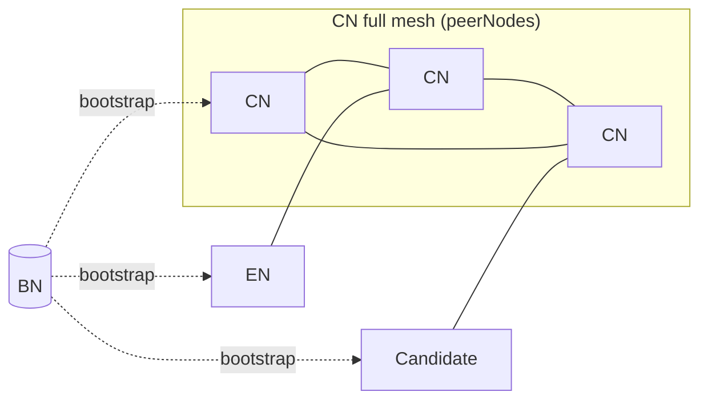

## Abstract

This KIP specifies the P2P network topology and peer-admission rules that Consensus Nodes (CN), Endpoint Nodes (EN), and the bootstrap node (BN) MUST follow after the permissionless hard fork.
It defines the target network shape (a CN full mesh, with ENs connecting directly to CNs and all node types bootstrapped through a unified BN), the three-layer protocol stack (Node Discovery, RLPx, Kaia P2P), and the policies for each node role.
CN admission is governed by the on-chain validator state defined in [KIP-286](./kip-286.md) and [KIP-290](./kip-290.md): only validators whose `AddressBookV2` state lies in a well-defined `peerNodes` set are accepted as CN peers.
The Proxy Node (PN) role is retired: existing PN deployments remain operational for backwards compatibility but MAY be deprecated without notice.
A new authorized CN-to-CN `Roster` feature accelerates mesh convergence by letting CNs share their live peer view without routing every lookup through BN.

## Motivation

In the pre-fork Kaia P2P network, CN addresses are registered to CNBN through a manual process: operators edit configuration and call RPCs such as `PutAuthorizedNodes` to keep CNBN's allowlist in sync with the current validator set.
ENs do not connect to CNs directly — they reach the consensus network through PNs (Proxy Nodes), which sit between the CN mesh and end-user traffic and are themselves discovered via ENBN.
This arrangement works because the validator set is permissioned and rarely changes, so manual curation is tractable.

Permissionless operation changes three things at once, and the P2P layer has to accommodate all three:

- **CNs self-register.** Validators join and leave through the on-chain lifecycle defined in [KIP-286](./kip-286.md), with state recorded in the [`AddressBookV2`](./kip-290.md) registry. Operators no longer curate CNBN's peer list, so CN admission MUST be derived from live on-chain state and MUST react to state transitions without manual intervention.
- **PN is retired with backwards compatibility.** Existing PN deployments remain operational but PN is no longer part of the post-fork topology, and MAY be deprecated without notice. ENs can now connect directly to CNs without going through a PN, which means CNs MUST accept and serve EN peers without degrading consensus latency among themselves.
- **Bootstrap node is no longer role-specific.** With PN retired from the post-fork topology and CNs self-registering, the pre-fork split between CNBN (for CNs) and ENBN (for ENs and PNs) loses its purpose. A single unified BN bootstraps every node type.

Without these rules codified at the protocol layer, nodes from different clients cannot interoperably converge on the same mesh after the permissionless hard fork.

## Specification

The key words "MUST", "MUST NOT", "REQUIRED", "SHALL", "SHALL NOT", "SHOULD", "SHOULD NOT", "RECOMMENDED", "MAY", and "OPTIONAL" in this document are to be interpreted as described in RFC 2119.

### Parameters

| Parameter | Description                                                                                                                                              | Sample Value |
| --------- | -------------------------------------------------------------------------------------------------------------------------------------------------------- | ------------ |
| `MaxCN`   | Maximum number of CN peer connections a CN maintains. Bounded by `MaxNodeCount` from [KIP-286](./kip-286.md).                                            | 100          |
| `MinEN`   | Minimum number of EN peer connections (ingress and egress combined) a CN maintains for block-sync availability. Below this, the CN dials additional ENs. | 2            |
| `MaxEN`   | Maximum number of EN peer connections (ingress and egress combined) a CN accepts.                                                                        | 10           |

### Terms

- **ℕ**: the set of all CN nodes.
- **R(n)**: node `n` is registered in `AddressBookV2`.
- **state(n)**: assuming `R(n)`, the `AddressBookV2` state of node `n` as defined in [KIP-286](./kip-286.md).
- **peerNodes**: `{ n ∈ ℕ | R(n) ∧ state(n) ∈ { CandReady, CandTesting, ValActive, ValReady, ValPaused } }`.
- **nonPeerNodes**: `ℕ \ peerNodes`, equivalent to `{ n ∈ ℕ | ¬R(n) ∨ (R(n) ∧ state(n) ∈ { Registered, ValInactive, ValExiting }) }`.
- **ConnType**: the peer-role label declared by each side at the Layer 2 RLPx handshake. Post-fork values for new topology: `{ CN, EN, BN }`. `PN` remains a valid legacy value for backwards compatibility with existing deployments.
- **Roster**: authorized CN-CN feature that returns the responder's in-memory peerNodes view with dial information.
- **Discovery ping**: UDP ping in the Node Discovery Protocol (as opposed to "RPC call" for on-chain/HTTP queries).

The `SuspendedSet` maintained by `AddressBookV2` does NOT affect P2P admission or routing decisions.

Unless explicitly stated otherwise, all requirements below apply at Layer 2 (RLPx transport) of the protocol stack.

### Post-HF Network Topology

Solid edges are persistent peer connections (CN–CN mesh, direct EN–CN).
Dashed edges are bootstrap introductions only; BN does not relay traffic after discovery.

- BN is the single bootstrap node for all node types, replacing the pre-fork CNBN (for CNs) and ENBN (for ENs and PNs).
  No per-role bootstrap nodes exist post-fork.
- The Proxy Node (PN) role is retired at the permissionless hard fork.
  Existing PN deployments remain operational for backwards compatibility but MAY be deprecated without notice; no new PN requirements apply post-fork.

### Protocol Stack

The three-layer protocol stack described below already exists in the pre-fork Kaia client and is not changed by this KIP.
It is reproduced here as background so that the requirements in the following sections can refer to specific layers without ambiguity.

| Layer   | Protocol             | Purpose                                                                                                                         |
| ------- | -------------------- | ------------------------------------------------------------------------------------------------------------------------------- |
| Layer 1 | UDP / Node Discovery | Node advertisement, mutual reachability proof (bonding via PING/PONG), neighbor lookup (FINDNODE/NEIGHBORS).                    |
| Layer 2 | TCP / RLPx           | Encrypted session establishment, NodeId ownership proof via ECDH, peer capability negotiation (`protoHandshake`).               |
| Layer 3 | Kaia P2P             | Chain and network identity confirmation via `StatusMsg`, followed by protocol messages (consensus, block sync, tx propagation). |

A single node key (an ECDSA private key over the secp256k1 curve) is used across layers:

- Layer 1 signs every UDP packet (per-message authentication).
- Layer 2 authenticates once via ECDH (session authentication, followed by symmetric encryption).

### CN Requirements

#### R1. Mesh Topology

A CN MUST attempt to maintain peer connections in a full mesh with all `peerNodes` except itself.

#### R2. Peer Node Type Verification

Upon receiving an inbound connection from a node claiming `ConnType == CN`, a CN MUST verify the counterparty's `AddressBookV2` registration and current `peerNodes` membership.
A node claiming CN without being in `peerNodes` MUST be rejected.

- Enforcement MUST occur at Layer 2 once the remote `NodeId` (and thus the address derivable from it) is known, and before Layer 3 message processing begins.
- The check applies only when the counterparty claims `ConnType == CN`.
  EN and BN connections bypass this check.
  Operator-configured trusted peers MAY bypass this check; each bypass SHOULD emit an audit log.
- Rejection at this stage avoids the round trips of completing the Layer 3 handshake and the subsequent `StatusMsg` exchange only to disconnect.

##### R2.1. CN-side Rate Limiting

A CN MUST enforce a rate limit on UDP pings originating from unknown NodeIds, budgeted per source IP.

#### R3. CN Acceptance

A CN:

- MUST maintain CN-CN peer connections only with members of `peerNodes`.
- MUST disconnect from a CN whose `AddressBookV2` state transitions such that it is now in `nonPeerNodes`.
  Implementations SHOULD attempt a bounded graceful drain before hard-closing to avoid losing in-flight consensus messages.
- MUST accept inbound connections from CNs in `peerNodes`.
- MUST reject inbound connections from CNs in `nonPeerNodes`.
- MUST limit the number of CN connections to `MaxCN`.

Activation: R2 and R3 enforcement takes effect at the permissionless hard fork activation block.
Before the activation block, legacy behavior applies.
After the activation block, `peerNodes` enforcement is in effect for inbound acceptance and outbound dialing alike.

#### R4. EN Acceptance

A CN:

- MUST accept UDP ping (bond) requests from ENs.
- MUST accept peer requests from ENs.
- MUST limit the number of EN connections to `MaxEN`.

#### R5. Roster

CN-CN communication MUST support a `Roster` feature that returns all `peerNodes` dial information known to the responder.

- `Roster` is an authorized feature and MUST be served only to verified CNs (i.e., counterparties that have passed R2).
- A `Roster` response MUST include the `block_number` at which the `peerNodes` view was computed.
  Requesters MAY deduplicate responses by `(NodeId, block_number)` and SHOULD discard older snapshots.
- `Roster` MUST be carried as a new message type within the Layer 3 Kaia P2P protocol, reusing the authenticated session established by the Layer 2 handshake.
- A CN MUST enforce a per-requester rate limit on `Roster` to prevent resource exhaustion.
  When the limit is exceeded, the responder MUST return an explicit rate-limit error rather than an empty response, so the requester can distinguish backoff from a legitimately empty view.

#### R6. Sync Discipline

- If a CN intends to become a candidate, it MUST be fully synced before transitioning to `CandReady`.
- If a CN is in `ValInactive`, it MUST be fully synced before transitioning to `ValReady`.
- A CN in `nonPeerNodes` MUST sync blocks from ENs, since it will be rejected by other CNs under R3.
- A CN MUST maintain at least `MinEN` EN peer connections (ingress and egress combined) at all times, regardless of its own validator state, to ensure block-sync availability across state transitions and network partitions.
  When the count falls below `MinEN`, the CN MUST actively dial additional EN peers.

#### R7. BN Coverage

A CN MUST bond with every configured BN address, not just a subset.

### BN Requirements

#### R11. Ping Acceptance

A BN MUST accept UDP ping (bond) requests from both CNs and ENs.

#### R12. Unbiased Sampling

A BN's neighbor-selection algorithm MUST be random, so that neither CN nor EN responses are biased toward a subset of the network.

#### R13. Rate Limiting

A BN MUST enforce a rate limit on discovery pings from unknown NodeIds to prevent amplification and DoS attacks against the BN UDP endpoint.

### Premises

1. BN is the sole bootstrap entry point for all node types; the pre-fork CNBN (for CNs) and ENBN (for ENs and PNs) are unified into a single BN.
2. CN admission is decided directly between CNs, using `AddressBookV2` state as the source of truth for `peerNodes` membership.
   BN performs no admission filtering.
3. Dial information (`endpoint` = IP, UDP port, TCP port) is learned at the network layer via bonding and handshake.
   `AddressBookV2` carries only `{ NodeId, state }`, not `endpoint`.
4. The `SuspendedSet` does NOT affect P2P-layer authorization.
5. `NodeId` is immutable.
   Key rotation requires a full `deleteNode()` followed by re-onboarding.
6. `|peerNodes| ≤ MaxNodeCount` as defined in [KIP-286](./kip-286.md).
   `MaxCN` is chosen so that R1's full-mesh requirement (at most `MaxNodeCount - 1` peers per CN) always fits within the R3 cap.

## Rationale

### Why `peerNodes` excludes `ValInactive` and `ValExiting`

A CN that may participate in consensus at the next epoch must already be peered into the mesh before the transition — bootstrapping into the mesh during the transition would introduce connection latency at the moment consensus needs the node online.
This drives `peerNodes` membership:

- `ValActive`, `ValPaused`: currently participating, or able to resume at any block; stay peered.
- `ValReady`: may be promoted to `ValActive` at the next epoch if it makes the top-50 by stake; must be peered beforehand so the promotion is a no-op at the P2P layer.
- `CandReady`, `CandTesting`: transitioning toward consensus participation (`CandReady` → `CandTesting` → possibly `ValActive`); must be peered so that VRank testing actually exercises consensus.

By contrast, `ValInactive` and `ValExiting` cannot reach `ValActive` at the next epoch from their current state:

- `ValInactive` must first transition to `ValReady` via an explicit user tx; it enters `peerNodes` only at that point.
- `ValExiting` transitions to `ValInactive` at the next epoch, not to an active state.

Including either in `peerNodes` would consume CN peer slots and consensus bandwidth without unlocking any participation path.

### Why CNs MUST bond with every configured BN

Without the pre-fork `AuthorizedNodes` allowlist, each BN learns CNs passively — only when a CN pings it.
If CNs bond with only a subset of configured BNs (as would happen under a target like `discoverTargets[BN] = 3`), BNs that were never pinged have an incomplete node database.
ENs querying those under-informed BNs receive a biased CN sample: not because the NEIGHBORS sampling algorithm in R12 is biased, but because the source set is incomplete.
R7 closes this gap at the protocol layer by requiring full CN↔BN bonding coverage, so every BN's database converges to the full CN set.

### Why BN performs no admission filtering

Pre-fork, CNBN filtered discovery pings against an operator-curated `AuthorizedNodes` allowlist distributed out of band.
Post-fork, validator-set membership changes dynamically via `AddressBookV2`, so an out-of-band list cannot stay current, and with the `Roster` feature (R5) CNs can propagate their authoritative `peerNodes` view among themselves.
BN therefore performs no admission check — it accepts pings from any node type (R11) and serves unbiased NEIGHBORS responses (R12), which simplifies its DoS posture (R13 rate limiting is the only gate) and removes a single point of admission failure.

### Why R2 enforces only on `ConnType == CN`

The sybil threat addressed by R2 is exhaustion of the CN peer slot budget (capacity `MaxCN`).
A node that claims EN self-downgrades into the EN pool (capacity `MaxEN`, no consensus traffic, no `Roster` access), so no slot-exhaustion incentive exists for claiming EN.
The symmetric case — a legitimate CN in `nonPeerNodes` (e.g., `ValInactive`) connecting as an EN to sync blocks under R6 — is intentionally preserved.
Attempting to distinguish a malicious CN-as-EN downgrade from a legitimate R6 egress would require tracking peer history beyond what `peerNodes` membership provides, with no compensating security benefit.

### Why `Roster` runs on the Kaia P2P protocol

A full `peerNodes` snapshot with dial information for up to `MaxNodeCount = 100` entries exceeds the 1280-byte Node Discovery UDP packet size limit, ruling out Layer 1 as a carrier.
Among the remaining options (an independent TCP channel, an authenticated RPC endpoint, or a new message type within the existing Kaia P2P protocol), Layer 3 is chosen because it reuses the authenticated Layer 2 session: no new port, no second auth model, and it sits alongside the existing consensus and block-sync messages that are already scoped to CN peers.

### Why explicit `Roster` rate-limit errors

An empty `Roster` response is ambiguous — it can mean either "the responder has no peers" or "the responder is rate-limiting you."
Requesters must be able to distinguish these so that backoff logic does not fight legitimate topology churn.
R5 therefore mandates an explicit rate-limit error rather than an empty response.

## Backwards Compatibility

This KIP requires the permissionless hard fork.
Before the fork block, legacy P2P behavior (static `AuthorizedNodes`, permissioned CN set, PN role active) continues unchanged.
After the fork block:

- The PN role is retired. Existing PN deployments remain operational for backwards compatibility but MAY be deprecated without notice.
- CNs MUST admit peers based on `peerNodes` membership, not a static allowlist.
- Nodes that do not implement R2 will still interoperate as EN peers, but will be rejected on CN-claimed connections.
  Non-conforming CNs cannot join the post-fork mesh.

Clients depending on pre-fork P2P assumptions MUST review this document and update their implementations accordingly.

## Security Considerations

### CN peer-slot exhaustion

The primary sybil threat is a non-CN attempting to consume the CN peer slot budget (`MaxCN`) by claiming `ConnType == CN`.
R2 rejects these attempts before Layer 3 processing, bounding the cost of a rejection to a single Layer 2 handshake.
R2.1 adds per-source-IP UDP rate limiting so that even in-memory `peerNodes` lookups cannot be driven into saturation.

### BN as an attack target

Because BN performs no admission filtering, it accepts discovery pings from any node — the pre-fork `AuthorizedNodes` allowlist no longer gates traffic.
R13 (rate limiting) mitigates amplification and DoS risk.
Operators MUST provision BN with capacity and network-layer protections appropriate to an internet-reachable UDP service without peer-list filtering.

### Race between state transition and peer admission

A candidate that calls `readyCandidate` at block `N` may be briefly rejected by CNs that have not yet observed block `N`.
R2 does not offer a grace window for this race: introducing one would create a spoof window in which a non-member could transiently pass admission.
The sub-second retry cost is accepted instead.
Implementations MUST NOT add such a window.

### Trusted-peer escape hatch

Operator-configured trusted peers bypass R2 admission.
This preserves an operational escape hatch (e.g., during a coordinated recovery) but widens the authorization surface.
Each bypass SHOULD be audit-logged so that operators can detect unintended bypass usage.

## References

- [KIP-286: Permissionless Validator Lifecycle](./kip-286.md) — defines the `AddressBookV2` state machine and `MaxNodeCount`.
- [KIP-290: Permissionless Smart Contracts](./kip-290.md) — defines `AddressBookV2` and the `State` enum referenced here.
- [RFC 2119: Key words for use in RFCs to Indicate Requirement Levels](https://www.rfc-editor.org/rfc/rfc2119) — governs the MUST / SHOULD / MAY vocabulary used in the Specification.
- [Ethereum devp2p specification](https://github.com/ethereum/devp2p) — historical base for the Node Discovery Protocol (Layer 1) and RLPx (Layer 2); Kaia inherited these from go-ethereum.

## Copyright

Copyright and related rights waived via [CC0](../LICENSE.md).
